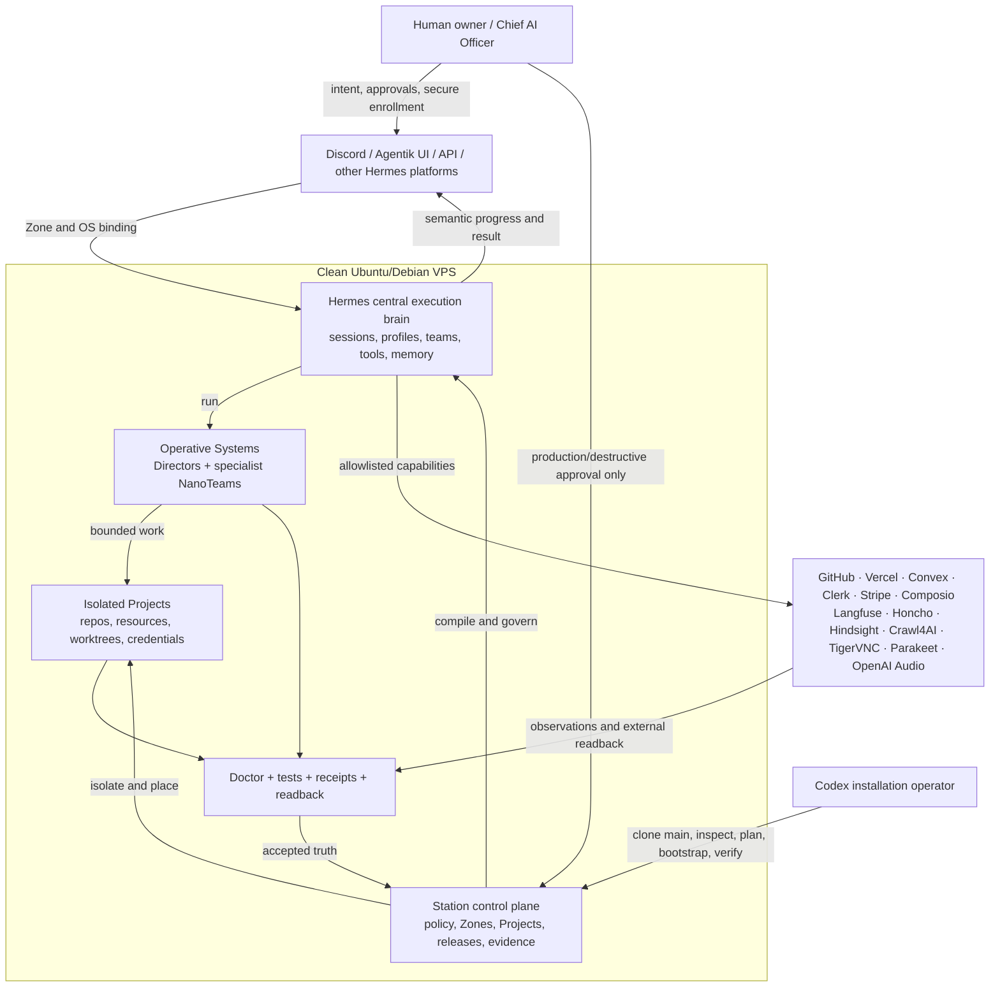

# Chief AI Officer AIOS — VPS System

## Agentik Station 11.12

Agentik Station turns a clean Ubuntu/Debian VPS into a governed **Chief AI Officer AI Operating System**. Station owns the Linux foundation, isolation, policy and evidence. Hermes is the central agentic brain. Operative Systems supply specialized AI teams. Discord, the Agentik UI and other Hermes platforms are the human control surfaces.

**Release:** `11.12`  
**Posture:** final repository candidate  
**Current verified claim:** the repository can compile a typed plan and reconcile the Station Linux foundation, immutable release, Zones, Projects, desired OS declarations, receipts, and Doctor state to `READY_FOR_SETUP` on the supported Ubuntu/Debian provider. It does **not** claim that Hermes, Discord, Composio, remote Fleet reconciliation, encrypted off-Host backup, or any OS package is already operational.

**Start with [`atlas.md`](atlas.md)** for the full map: Hermes central brain, filesystem, Zones/Projects, OS Factory, resources, Discord bootstrap, DevOps team, installation, updates and acceptance.

## Can I give Codex the repository link and say “install and setup”?

**Yes for the complete reproducible VPS foundation.** Start Codex as a newly created, non-root user that has `sudo`; do not run the Codex session itself as root. Codex can clone the one canonical `main` branch, read the repository instructions, inspect the VPS, show the plan, run the full bootstrap after your approval, and verify the resulting Host.

Minimum starting conditions are a supported Ubuntu/Debian systemd VPS, network/DNS access, the new user able to run `sudo`, and an authenticated Codex session. Codex can install `git` and CA certificates first if the base image does not include them.

**External accounts still need you at their secure gate.** Codex cannot invent Discord applications/tokens, GitHub/Vercel/Convex/Clerk/Stripe/Composio credentials, model-provider authentication or OAuth consent. The first Discord/Tailscale enrollment is therefore human-owned. After it, the Station bot can issue short one-time `.ts.net` setup buttons so later keys and OAuth/device flows stay out of chat, shell arguments, Git, logs and evidence.

Give Codex this exact prompt on the clean VPS:

```text
Install and set up the Chief AI Officer AIOS from the canonical main branch:
https://github.com/agentik-os/agentik-station

Work as my current non-root sudo user; do not run Codex itself as root.
Clone only branch main with --single-branch into a normal user workspace, then read
AGENTS.md, atlas.md, SECURITY.md, INSTALL.md, SETUP.md and AI_INSTALL_PROMPT.md.
Run repository Doctor and inspect the VPS. Show me the exact installation plan before
mutation. After I approve it, run the full bootstrap with the optional AI stack:
sudo ./bootstrap.sh --mode full --with-ai-stack

Then run full Station Doctor, status, module status and toolchain checks. Continue through
SETUP.md one external gate at a time. Never ask me to paste a secret into chat and never
place a token in a command argument or repository. Use the provider/Hermes interactive
login flow. Keep anything without real external readback below OPERATIONAL and report the
remaining human actions precisely.
```

This is the direct shell start if you prefer to clone first:

```bash
git clone --branch main --single-branch https://github.com/agentik-os/agentik-station.git
cd agentik-station
./station doctor --repo
sudo ./bootstrap.sh --mode full --with-ai-stack
```

Do not add `--yes` until the generated plan has been reviewed.

## Chief AI Officer AIOS logic



The standalone diagram source is [`docs/diagrams/14_CHIEF_AI_OFFICER_AIOS_VPS.mmd`](docs/diagrams/14_CHIEF_AI_OFFICER_AIOS_VPS.mmd).

The secure bot setup + voice routing diagram is [`docs/diagrams/15_GUIDED_SETUP_AND_VOICE.mmd`](docs/diagrams/15_GUIDED_SETUP_AND_VOICE.mmd).

## What the one-command bootstrap does

With `--mode full --with-ai-stack`, bootstrap:

1. audits the current VPS and repository;
2. creates the dedicated `agk-station` sudo account and moves managed source out of `/root`;
3. installs the pinned Python, AI Python, Node/npm, GitHub, Vercel, Codex, Composio and shadcn toolchain, plus the isolated integrity-locked discord.js SDK and signed stable Tailscale package;
4. installs the reviewed Hermes release, explicit voice/messaging extras and backup/Doctor-gated update timer;
5. installs loopback-only Parakeet for Discord STT failover and stages Ponytail, Langfuse, Honcho, Hindsight, Crawl4AI and TigerVNC;
6. installs AGK-TUI;
7. reconciles `/etc/station`, `/opt/station`, `/srv/station`, `/var/lib/station`, logs, backups and runtime paths;
8. creates isolated Zones and Projects with independent Unix identities and `HERMES_HOME` roots;
9. installs the immutable Station release, desired OS declarations, systemd units and receipts;
10. starts the local one-time setup broker and publishes it through private Tailscale Serve only when the Host is already enrolled;
11. runs Station Doctor and stops at the truthful state `READY_FOR_SETUP`.

After that, Codex can guide the setup gates, but you must complete the secure provider/OAuth/token interactions and approvals. `OPERATIONAL` is reached only after real readback.

## The simplest mental model

```text
Station = constitution + Linux control plane + isolation + evidence
Hermes  = central brain and execution/orchestration fabric, isolated per Zone
OS      = installable AI department with one Director and a specialist team
Project = owned work, source, knowledge, resources, credentials and evidence
Tools   = bounded hands connected through capabilities
Discord = human cockpit, never the source of truth
Doctor  = truth gate; a claim without evidence does not pass
```

## Main-only repository policy

`main` is the only canonical and distributable branch. Installation instructions always clone `main` with `--single-branch`. Temporary implementation branches may exist only while integrating a reviewed change and must be deleted locally and remotely immediately after merge; there is no long-lived `develop`, release or vendor branch.

## CI and optional review assistants

GitHub Actions, the Station test suite, Builder/Librarian gates and `station doctor --repo` are the canonical repository verification system. CodeRabbit or any other third-party review bot is optional and may be enabled by a repository owner for extra review. Station installation, Hermes, OS compilation, readiness and release acceptance never depend on CodeRabbit being installed, available or within quota.

## One-repository direction

The target workflow is intentionally simple:

```text
Fresh Ubuntu/Debian VPS
    ↓
install a trusted coding agent
    ↓
git clone agentik-station
    ↓
agent reads AGENTS.md and the architecture/security contracts
    ↓
./station doctor --repo
    ↓
./station plan
    ↓
sudo ./install
    ↓
Linux foundation + Station safe kernel
    ↓
READY_FOR_SETUP
    ↓
operator-controlled external enrollment and acceptance gates
    ↓
OPERATIONAL
```

The repository is therefore both:

1. the canonical architecture and policy source;
2. the executable desired state for the supported Station Kernel;
3. the source used to build immutable Station releases;
4. the implemented OS→Hermes Profile Distribution compiler and the governed source for maturing Discord, Composio and Fleet reconcilers.


## One-command host bootstrap

For a fresh supported Ubuntu/Debian VPS, clone the repository once, then run:

```bash
sudo ./bootstrap.sh --mode full
```

For a company/team installation:

```bash
sudo ./bootstrap.sh --mode team --organization organization-alpha --project platform
```

The bootstrap creates the dedicated sudo account `agk-station`, relocates the working checkout to `/home/agk-station/repos/agentik-station`, installs the pinned operator toolchain, installs the reviewed Hermes release with voice/messaging support in `/opt/station/tools/hermes/current`, installs local Parakeet, and invokes the same typed Station plan/apply workflow. The shared Hermes launcher can execute for every Zone, but configuration, credentials, sessions and bot state remain isolated in that Zone's `HERMES_HOME`. Source and user tooling stay out of `/root`; external authentication remains an explicit setup gate.

The default toolchain is Python 3.14.7, Node.js 24 LTS, npm, GitHub CLI, Vercel CLI, Codex CLI, Composio CLI, shadcn CLI and an isolated discord.js 14.27.0 SDK resource. Isolated AI SDKs/tools use Python 3.13.15 for current wheel compatibility. Hermes deliberately keeps its own supported Python 3.11 environment because the current upstream release requires Python `<3.14`. Exact pins live in [`config/versions.lock`](config/versions.lock). Hermes remains the only messaging Gateway; installing discord.js does not create another bot process.

To stage every optional AI component as well:

```bash
sudo ./bootstrap.sh --mode full --with-ai-stack
```

This installs or stages Ponytail, Langfuse, Honcho, Hindsight, TigerVNC, Crawl4AI and Parakeet, but does not create accounts, inject secrets, expose public ports or claim those services operational. Parakeet is also part of the default voice install; use `--skip-voice` only when deliberately omitting Hermes voice support.

`full` maps to the complete Agentik Station (operator Host). `team` is the company install: shared System foundation + one Organization Zone; Discord/Composio/memory/credentials are member-scoped principals so several people share the Host without a single global Private Zone. There is no separate client-branded mode — pass your organization/project ids at bootstrap time.

## Canonical model

```text
STATION
├── HOSTS
├── CONTROL PLANE
├── ZONES
├── PROJECTS
├── OPERATIVE SYSTEMS
├── WORKSPACES
└── FLEET
```

- **Host**: a Linux machine or VPS.
- **Control Plane**: desired state, policies, registries, bindings, release metadata, and evidence indexes.
- **Zone**: the canonical isolation and operational boundary placed on a Host.
- **Project**: all source, knowledge, integrations, credential references, state references, workspaces, artifacts, evidence, and operations for one product/client project.
- **Operative System**: a governed installable operational capability executed by Hermes.
- **Workspace**: a temporary mission environment such as a worktree or sandbox.
- **Fleet**: all Hosts and their Zone placements, controlled through explicit desired state and observed evidence.

Local and remote are placement decisions, never different project architectures:

```text
organization-alpha-dev   → host: station-core-01
organization-alpha-prod  → host: organization-alpha-prod-01
example-project-dev      → host: station-core-01
example-project-prod     → host: example-project-prod-01
```

## Clean Linux layout

```text
/etc/station               canonical desired state and policies
/opt/station/releases      immutable Station releases
/opt/station/current       atomic active-release pointer
/srv/station               human-operational navigation and Zone assets
/var/lib/station           observed state, receipts, Hermes/runtime databases
/var/log/station           Station and per-Zone logs
/var/backups/station       local backup staging only
/run/station               ephemeral runtime state and locks
```

Human navigation stays small:

```text
/srv/station/
├── 1_CONTROL/             generated projection; never source of truth
├── 2_ZONES/
│   ├── 1_SYSTEM/
│   ├── 2_PRIVATE/
│   ├── 3_AGENTIK/
│   ├── 4_ORGANIZATIONS/
│   ├── 5_PROJECTS/
│   ├── 6_FACTORY/
│   └── 7_LAB/
├── 3_SHARED/              non-secret, read-only distributions/assets/resources
└── 4_ARCHIVE/
```

## Station 11.12 verified foundation

- strict ASCII identifier validation before path or command construction;
- resolved paths confined to explicit Station roots;
- descriptor-based traversal and symlink refusal for privileged writes;
- atomic managed-file replacement;
- immutable versioned releases with an atomic `current` pointer;
- argument-array subprocess execution rather than reconstructed shell commands;
- remote bootstrap receives desired state as a validated JSON `InstallSpec`;
- strict SSH host-key checking by default;
- exact Zone Unix identity, group, home, state root, and ownership contracts;
- correct Project ownership under the parent Zone identity;
- no global `HERMES_HOME`, global cross-organization `.env`, or shared credential namespace;
- desired OS packages remain `NOT_INSTALLED` until explicitly installed; Station 11.12 includes the OS→Hermes Profile Distribution compiler, while live runtime acceptance remains evidence-gated;
- explicit module maturity and next repair actions;
- operation receipts and a `DEGRADED` state on failed reconciliation;
- repository and installed-Host Doctor checks;
- installed Doctor reconstructs Zone/Project roots and identities before inspecting their filesystems;
- the release manifest must match the exact packaged file inventory and verified claim;
- no unattended external network installer executed by the safe kernel.

## Evidence before claims

Station uses a strict evidence ladder:

```text
PREPARED
→ OBSERVED
→ REPORTED
→ VERIFIED
→ READ_BACK
→ ACCEPTED
```

Examples:

- a plan is not execution;
- an executor report is not verification;
- a copied OS package is not an installed OS;
- a present binary is not a configured connector;
- a deployment command is not successful readback;
- a cron definition is not enabled until fresh-session acceptance passes.

## Commands

```bash
./station doctor --repo
./station plan --host-id station-core-01 --role core
sudo ./install --host-id station-core-01 --role core
station doctor --full
station status
station module status
station provider status
station provider composio-discord plan --zone <zone-id>
sudo station provider composio-discord link --zone <zone-id>
sudo station provider composio-discord verify --zone <zone-id>
station client doctor <client-id> --online
station deps toolchain-check
station deps list
sudo station platform setup --zone <zone-id> --platform slack
sudo station platform install --zone <zone-id>
sudo station platform status --zone <zone-id>
```

A team Host example:

```bash
./station plan \
  --host-id organization-alpha-prod-01 \
  --role team \
  --seed-category ORGANIZATIONS \
  --seed-name organization-alpha \
  --seed-env production \
  --seed-organization organization-alpha \
  --seed-project platform
```

Read [`INSTALL.md`](INSTALL.md) before applying and [`SETUP.md`](SETUP.md) before enrolling external accounts or credentials.

## Current module truth

| Module | Repository maturity | External acceptance |
|---|---|---|
| Station Kernel | VERIFIED | base Host readback still required on a fresh VPS |
| Host foundation | VERIFIED | reboot/system-service gate required on real Host |
| Zone runtime | VERIFIED | rootless negative-isolation runtime gate pending |
| Hermes runtime/compiler | INSTALLABLE | profile/gateway/plugin/fresh-session gate pending |
| Operator toolchain | INSTALLABLE | GitHub/Vercel/Composio/Codex login and scoped readback pending |
| Resource catalog | INSTALLABLE | Project dependency/provider setup and tests pending |
| Hermes platforms | INSTALLABLE | per-Zone platform enrollment and live message readback pending |
| Voice + guided setup | INSTALLABLE | OpenAI/Parakeet/Tailnet/bot live round-trip pending |
| Discord Experience | INSTALLABLE | dedicated test-guild create/edit/interactions/readback pending |
| Composio plane | INSTALLABLE | OAuth/session/MCP/trigger/revocation gate pending |
| OS Factory | INSTALLABLE | real Librarian→Builder→Hermes→recovery acceptance pending |
| DevOps OS semantics | VERIFIED | live Hermes/Discord/provider/release acceptance still required |
| Fleet Control | INSTALLABLE | remote disposable-Host drift/rollback gate pending |
| Backup/recovery | INSTALLABLE | off-Host backup + destructive restore rehearsal pending |
| Observability | INSTALLABLE | production alert/readback/retention gate pending |

See [`modules/catalog.json`](modules/catalog.json) for machine-readable claims and repair actions.

## Documentation map

- [`AI_INSTALL_PROMPT.md`](AI_INSTALL_PROMPT.md): exact copy/paste instruction for Codex on a clean sudo-capable VPS session.
- [`atlas.md`](atlas.md): complete end-to-end operator atlas and setup sequence.
- [`ARCHITECTURE.md`](ARCHITECTURE.md): complete final architecture.
- [`INSTALL.md`](INSTALL.md): typed plan/apply and Host-role workflows.
- [`SETUP.md`](SETUP.md): external enrollment and acceptance gates.
- [`SECURITY.md`](SECURITY.md): threat model and hardening rules.
- [`AGENTS.md`](AGENTS.md): mandatory behavior for coding agents.
- [`docs/hardening/`](docs/hardening/): 11.12 audit response and safe reconciler design.
- [`docs/history/v9/`](docs/history/v9/): preserved design provenance, never current runtime truth.
- [`docs/audit/`](docs/audit/): professional v10 audit and evidence bundle that drove the 11.x hardening program.

## One-command orchestration wrapper

For operators who want one safe entry point, the repository ships `station.sh`. It is a Bash orchestration wrapper around the typed Python Station kernel; it does **not** duplicate installer logic.

```bash
./station.sh bootstrap --host-id station-core-01 --role core
```

The wrapper performs, in order:

```text
Repository Doctor
→ create one validated InstallSpec
→ Plan • not run
→ explicit confirmation (or --yes in controlled automation)
→ sudo apply using the exact same InstallSpec
→ full recorded Host Doctor
→ status
→ remaining external setup gates
```

Generic client and project examples use only `organization-alpha` and `example-project`. No real client or personal project identity belongs in the canonical repository.

## AGK-TUI (live sessions)

After bootstrap, open Hermes / Codex / Claude Code / terminal sessions with `agk` or `station tui`. Manage client organizations with either `agk client ...` or the same controller exposed as `station client ...`.
Vendored at `components/agk-tui` (pin in `config/versions.lock`). See `INTEGRATION_AGK_TUI.md`.


## Hermes platforms + optional deps

- Verify the pinned toolchain: `station deps toolchain-check`
- Plan/link/read back the Zone-scoped Composio Discord adapter: `station provider composio-discord plan --zone <zone-id>`
- Inspect reviewed resources/default stack: `station resource list` and `station resource stack-plan`
- Update Hermes with backup, Doctor and receipt: `station hermes update`
- The weekly backup/Doctor/receipt-gated updater is enabled by bootstrap; opt out with `--skip-hermes-auto-update`, or enable it later with `sudo station deps enable-auto-update`.
- Configure a Zone bot on any supported surface: `sudo station platform setup --zone <zone-id> --platform <name>`
- Install/start its user service: `sudo station platform install --zone <zone-id>`
- Observe it: `sudo station platform status --zone <zone-id>` and then perform live message readback
- Install the optional stack: `sudo station deps install --all`
- Enable/read back private bot-guided setup after Tailscale enrollment: `sudo ./scripts/station_guided_setup_enable.sh`
- Voice architecture and acceptance: [`docs/dependencies/VOICE_AND_GUIDED_SETUP.md`](docs/dependencies/VOICE_AND_GUIDED_SETUP.md)

Supported Hermes gateway surfaces include Telegram, Discord, Slack, WhatsApp, Signal, SMS, Email, Home Assistant, Mattermost, Matrix, DingTalk, Feishu/Lark, WeCom, Weixin, BlueBubbles/iMessage, QQ, Yuanbao, Microsoft Teams, LINE, ntfy and browser chat. See [`docs/dependencies/HERMES_PLATFORMS.md`](docs/dependencies/HERMES_PLATFORMS.md) and [`docs/dependencies/STACK.md`](docs/dependencies/STACK.md).
