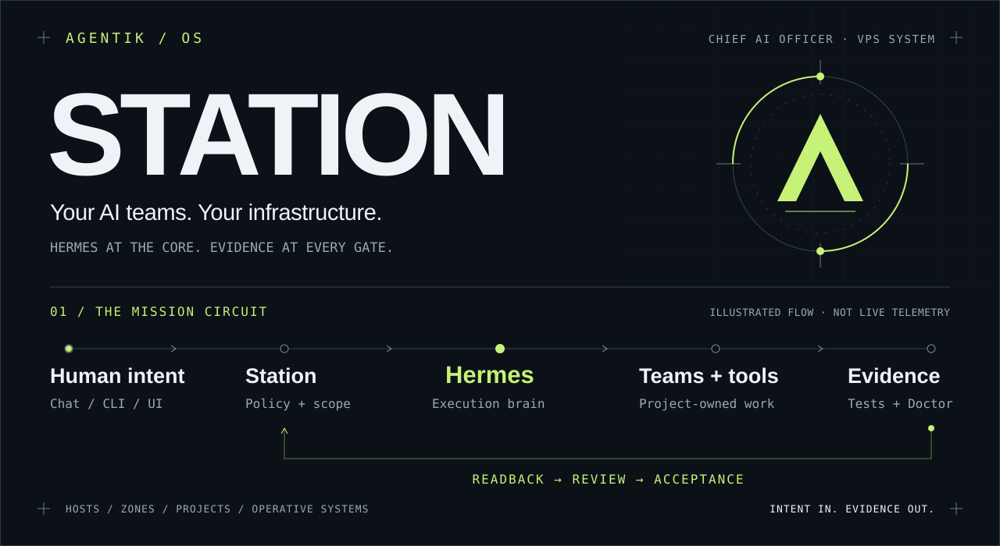
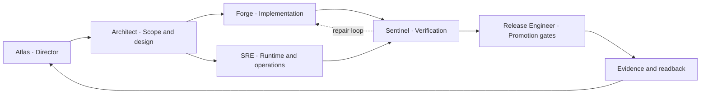

<p align="center">
  <a href="https://discord.gg/agentik-os"></a>
  <a href="atlas.md"></a>
  <a href="https://github.com/agentik-os/agentik-station/actions/workflows/ci.yml"></a>
</p>

<a href="#the-mission-circuit">
  
</a>

# Agentik Station

### AI teams deserve an operating system.

**Chief AI Officer AIOS — a governed agentic environment for your VPS.** Station provides the Linux foundation, policy, Zones and evidence. **Hermes is the central execution brain.** Installable Operative Systems give it specialized teams; Discord and other Hermes chat platforms give you a place to direct the work.

Bring your projects, models and tools. Give every mission an owner, a workspace and a verification gate.

**[Get started](#quickstart)** · **[How it works](#the-mission-circuit)** · **[Meet the teams](#operative-systems)** · **[Explore the tools](#the-toolchain)** · **[Read the atlas](atlas.md)** · **[Join Discord](https://discord.gg/agentik-os)**

> [!IMPORTANT]
> **Current posture: alpha / repository candidate, release line 11.12.** The supported foundation targets `READY_FOR_SETUP`, not a fully operational AI workforce. External accounts, live chat, OS execution, recovery and provider acceptance need their own evidence. See [readiness](#readiness-without-the-fine-print) and the [deep audit](docs/audit/2026-09-05-station-deep-audit.md). Source is publicly readable; **[all rights reserved](LICENSE.md)**, not an open-source license.

## Why Station

An agent can run a command. An operational system also needs to know **whose project it is, which identity may act, where the work belongs, and what proves it succeeded.**

- **A place for everything.** Hosts run Zones; Zones own identities and runtime state; Projects own repos, knowledge, worktrees, credentials and evidence.
- **One execution engine.** Hermes provides profiles, sessions, delegation, Skills, Kanban, hooks and tools. Station builds around it, not a competing scheduler.
- **AI departments, not loose prompts.** Each OS packages a Director, specialists, workflows, provider routes, evaluations and recovery instructions.
- **Chat as the cockpit.** Direct work through Hermes messaging, with Station's Discord progress cards and protected setup flows. Chat is the interface, not the source of truth.
- **Evidence before “done.”** Plans, execution reports, tests, Doctor and external readback have different meanings. Acceptance is a gate, not a confident sentence.

These are the architecture and workflow contracts. They are **not** a claim that every declared permission or live integration is already enforced; the [audit](docs/audit/2026-09-05-station-deep-audit.md) tracks those gaps.

## Quickstart

Start on a **fresh Ubuntu/Debian VPS** with systemd, `apt-get`, network/DNS access, Git, and distribution Python **3.11+**. Use a **non-root user with sudo**; run your coding agent as that user. Review [installation](INSTALL.md) and [security](SECURITY.md) first. Other operating systems are not supported Host targets by this installer.

```bash
git clone --branch main --single-branch https://github.com/agentik-os/agentik-station.git
cd agentik-station

# Inspect the repository before touching the Host.
./station doctor --repo

# Review the bootstrap plan and confirm before installation.
sudo ./bootstrap.sh --mode full --with-ai-stack
```

**What happens next:** the bootstrap prepares the operator account, pinned toolchain, Hermes, selected dependencies, Station filesystem, Zones, desired OS declarations and Doctor receipts. A successful foundation stops at `READY_FOR_SETUP`. Continue through **[SETUP.md](SETUP.md)** to enroll accounts and verify real workflows.

Do not add `--yes` before reviewing the plan. `--with-ai-stack` installs or stages optional components; it does not authenticate services, activate every OS or run security scans.

<details>
<summary><strong>Prefer to hand this to your coding agent? Copy this brief.</strong></summary>

```text
Install and set up Agentik Station from:
https://github.com/agentik-os/agentik-station

Work as my non-root sudo user. Clone main with --single-branch.
Read AGENTS.md, atlas.md, SECURITY.md, INSTALL.md, SETUP.md and AI_INSTALL_PROMPT.md.
Inspect the VPS and run repository Doctor. Show the plan before mutation.
After my approval, run: sudo ./bootstrap.sh --mode full --with-ai-stack
Run full Doctor, status, module status and toolchain checks.
Continue through external setup one gate at a time using secure provider flows.
Never request secrets in chat, command arguments or Git.
Report what is verified, what remains untested and exactly what I must do next.
Do not label the system OPERATIONAL without the applicable acceptance evidence.
```

The canonical, more detailed handoff is **[AI_INSTALL_PROMPT.md](AI_INSTALL_PROMPT.md)**. A coding agent can automate installation steps; it cannot invent your accounts, grant itself consent or create Discord bot tokens on your behalf.

</details>

<details>
<summary><strong>Choose a smaller install, a team Host or an explicit plan/apply workflow.</strong></summary>

Choose **one** bootstrap mode for a fresh Host:

```bash
# Operator / Agentik Host; optional AI services are not all staged.
sudo ./bootstrap.sh --mode full

# Company Host; System foundation + an Organization Zone.
sudo ./bootstrap.sh --mode team --organization organization-alpha --project platform
```

Default bootstrap still includes the Hermes voice/messaging layer, Parakeet, ScrapeGraphAI and Crawl4AI. Deliberate opt-outs are documented in [INSTALL.md](INSTALL.md).

For lower-level control, `./station plan` and `sudo ./install` expose the typed kernel; `./station.sh bootstrap` wraps plan/confirmation/apply with one shared InstallSpec. These are not substitutes for the full dependency bootstrap. See the [installation workflows](INSTALL.md).

**Existing Host?** Do not overwrite an immutable release with different content under the same version. Read the [post-audit migration instructions](INSTALL.md#security-assessment-resource-and-post-audit-migration); OS profile upgrades currently require supervised configuration reconciliation.

</details>

## The mission circuit

**Intent in. Evidence out.** The animated circuit above is an architecture illustration, not a live status display. Follow a representative mission below; each stage expands into the corresponding ownership and verification contract.

> **Example brief:** “Build the billing flow for this Project, prepare a preview, and show me the evidence before production.”

**[01 Scope](#mission-01)** → **[02 Plan](#mission-02)** → **[03 Execute](#mission-03)** → **[04 Verify](#mission-04)** → **[05 Accept](#mission-05)**

<a id="mission-01"></a>
<details>
<summary><strong>01 / Scope — a message becomes owned work.</strong></summary>

Resolve the human principal, Host, Zone, Project, environment and requested capability. The OS Director receives the brief through the owning Hermes profile. An unresolved account or production target is a reason to stop, not guess.

**Contract:** [Zone and credential boundaries](SECURITY.md#zone-boundaries). **Expected output:** explicit scope and acceptance criteria. Discord remains a projection of the mission, not its authority store.

</details>

<a id="mission-02"></a>
<details>
<summary><strong>02 / Plan — Hermes gives the work a graph and an owner.</strong></summary>

Probe available tools and scoped accounts. The Director selects specialists; the team defines dependencies, the workspace, the verification owner and human approval gates. Reuse existing code and Hermes-native capabilities before adding another dependency.

**Contract:** [universal agent rules](rules/STATION_AGENT_RULES.md). **Expected output:** a reviewed Plan First graph, not execution disguised as a plan.

</details>

<a id="mission-03"></a>
<details>
<summary><strong>03 / Execute — specialists work inside the owning Project.</strong></summary>

Hermes runs persistent profiles or delegates bounded work. Forge works in a Project worktree; selected CLIs, APIs, MCP or Composio connections supply capabilities. Development uses its own credentials. A prepared preview or patch is an executor result, not proof of success.

**Contract:** [DevOps OS](os/devops/README.md). **Expected output:** artifacts, logs and an execution report linked to the mission. Profiles in one Zone share a Unix trust domain; separate roles alone do not create a security sandbox.

</details>

<a id="mission-04"></a>
<details>
<summary><strong>04 / Verify — “the command succeeded” is not the finish line.</strong></summary>

Run the relevant tests, Doctor, review and actual external readback. A preview needs its rendered behavior checked; a provider action needs the correct account and observed result. Sentinel's review is a workflow separation, not automatically an isolated security principal.

**Contract:** [verification engineering](docs/engineering/02_VERIFICATION_ENGINEERING.md). **Expected output:** evidence that agrees with the claimed outcome, or a precise failure and next repair action.

</details>

<a id="mission-05"></a>
<details>
<summary><strong>05 / Accept — authority stays outside the model.</strong></summary>

Production or destructive actions require the policy-defined human authorization. After the applicable gates pass, record acceptance and report the result through the human interface. Learning candidates are reviewed before promotion; a chat message cannot authorize itself.

**Contract:** [setup and fresh-session acceptance](SETUP.md). **Expected output:** an accepted outcome, or an honest lower readiness state. This walkthrough is a contract illustration, not a recorded production run.

</details>

**The whole model in one line:** Station governs → Hermes orchestrates → OS teams work → Projects retain the assets → verification feeds the next decision.

## Operative Systems

An **Operative System (OS)** is an installable AI department, not another Linux distribution. It bundles a Nano Director, a specialist NanoTeam, knowledge, ordered Skills, tools, workflows, memory policy, evaluations and recovery contracts.

| OS source | Its job |
| :--- | :--- |
| [Station Maintainer](os/station-maintainer/README.md) | Inspect Station and Hermes changes; prepare maintenance and compatibility work. |
| [Discord Bootstrap](os/discord-bootstrap/README.md) | Define and prepare the guild, channels, bot bindings and human-facing control surface. |
| [Fleet Operator](os/fleet-operator/README.md) | Coordinate Host placement, remote bootstrap and observed infrastructure state. |
| [Librarian](os/librarian/README.md) | Turn sources, operator knowledge and contrary evidence into verified working knowledge. |
| [Builder](os/builder/README.md) | Turn a capability brief and Librarian research into a versioned OS package for Hermes. |
| [DevOps](os/devops/README.md) | Organize architecture, implementation, operations, verification and release work. |

Canonical source lives only in `os/`. The compiler produces Hermes Profile Distributions; installation, bindings, profile Doctor and fresh-session acceptance are separate steps. The [catalog](os/CATALOG.json) currently marks these packages **`INSTALLABLE` / `NOT_INSTALLED`**, not running teams.

### Meet the DevOps team



For a **Strix mission**, Architect scopes sanitized source, a human approves disclosure and the disposable LAB, SRE runs the approved job, Sentinel triages, Forge fixes, and independent retesting precedes release. Strix is a tool under Hermes—not a second Station Director. Read the [team and LAB boundary](resources/strix/README.md) before enabling it.

## The toolchain

**One catalog. Explicit ownership. No “installed means connected” shortcuts.** Exact reviewed versions live in [versions.lock](config/versions.lock), with resources in [CATALOG.json](resources/CATALOG.json) and optional components in [stack.yaml](config/deps/stack.yaml).

| Layer | Components | Installation / activation boundary |
| :--- | :--- | :--- |
| **Execution** | Hermes; Python, AI Python, Node.js, npm, uv | Pinned runtimes; Hermes configuration and sessions belong to each Zone. |
| **Operator tools** | GitHub CLI, Vercel CLI, Codex CLI, Composio CLI, shadcn CLI, AGK-TUI | Bootstrap installs tools; account login and scoped readback are separate. |
| **Chat & voice** | Hermes messaging, Discord, discord.js, OpenAI audio, local Parakeet | Default voice layer and isolated SDK; bot tokens, audio keys and live round trips need setup. |
| **Web extraction** | [Crawl4AI](resources/crawl4ai/README.md), [ScrapeGraphAI](resources/scrapegraphai/README.md), Playwright | Default web resources. Station adapters fetch public HTML **without JavaScript**; Crawl4AI yields Markdown, ScrapeGraphAI uses a Zone key for structured extraction. |
| **Security assessment** | [Strix](resources/strix/README.md) | Optional CLI, included with `--with-ai-stack`. No automatic scans or Docker grants; execution needs an accepted disposable LAB and human approval. |
| **Memory & observability** | Honcho, Hindsight, Langfuse | Optional packages or source are staged; service configuration, retention and isolation need acceptance. |
| **Engineering & desktop** | Ponytail, TigerVNC | Optional capability setup; installed source is not a running or publicly exposed service. |
| **Private enrollment** | Tailscale and Station's guided setup broker | Human Tailnet enrollment first; private setup links afterwards. No public fallback. |

Explore the [dependency guide](docs/dependencies/STACK.md) for each component's role and activation gate. Hermes remains the only messaging gateway; Composio and discord.js extend capabilities rather than owning chat sessions.

### A preferred stack, not a required stack

**Next.js · React · Convex · Vercel · Clerk · Stripe · Tailwind CSS · shadcn/ui · Lucide**

The [web-product recipe](resources/stacks/web-product/README.md) provides the default. Other stacks are welcome when the Project records the choice, ownership and verification. Shared CLIs live in the operator toolchain; UI components, icons, framework dependencies and lockfiles live in the **owning Project repository**, never a global application dependency dump.

## Discord is the cockpit

**[Join the Agentik OS community → discord.gg/agentik-os](https://discord.gg/agentik-os)**

The community server is separate from your private Station deployment. Your own guild, accounts, tokens and permissions remain under your control.

The intended topology is **one installed OS → one Nano Director → one dedicated bot identity and primary channel**. Specialists collaborate inside Hermes; public bots should not create recursive bot-to-bot conversations.

1. **Enroll the first bot and Tailnet as the human owner.** A bot token cannot create more Discord applications or mint their tokens.
2. **Bind the bot to its Zone and OS.** Verify channel permissions, commands and message readback in a test guild. Remove any temporary bootstrap administrator elevation.
3. **Use guided setup for subsequent accounts.** After enrollment, short-lived, one-use private Tailnet links can open secret forms or allowlisted OAuth/device flows. Never paste credentials into Discord.
4. **Follow semantic mission progress.** Station's Discord experience is designed around editable progress cards, actions and linked evidence rather than raw tool chatter.

Prefer Telegram, Slack or another supported platform? Use the [Hermes platform setup](docs/dependencies/HERMES_PLATFORMS.md). Transport support does not imply identical Station card rendering; each surface needs its own live acceptance. [Voice and protected setup guide →](docs/dependencies/VOICE_AND_GUIDED_SETUP.md)

## Clean by construction

One **Station namespace**, with Linux responsibilities kept in their proper places. `/srv/station` is the human navigation root—not a replacement for the filesystem hierarchy.

```text
/etc/station          Desired state and approved policy
/opt/station          Immutable releases, OS distributions and shared tools
/srv/station          Human navigation, Zones, Projects and shared resources
/var/lib/station      Hermes state, connector state, memory and receipts
/var/log/station      System and per-Zone logs
/var/backups/station  Local recovery staging; not proof of off-Host backup
/run/station          Ephemeral runtime files and locks
```

Each Zone has its own Unix identity and `HERMES_HOME`. Each Project owns `repos/`, `docs/`, `knowledge/`, `resources/`, `worktrees/`, `credentials/`, `artifacts/` and `evidence/`. Local versus remote is Host placement, not a different tree.

Hermes, coding CLIs, providers and humans share the same **[Station agent rules](rules/STATION_AGENT_RULES.md)**. A model provider supplies cognition—not permission to bypass ownership, filesystem layout or approval. See the [full architecture](ARCHITECTURE.md) and [atlas](atlas.md).

<details>
<summary><strong>Everyday operator commands after installation.</strong></summary>

```bash
station status                  # Observed Host state
station doctor --full           # Installed-Host checks
station module status           # Maturity and next repair actions
station deps toolchain-check    # Observed tools versus reviewed pins
station resource list           # Reusable resource catalog
station resource stack-plan     # Inspect the preferred Project stack
station tui                     # Open AGK-TUI (also available as agk)
```

AGK-TUI opens Hermes, Codex, Claude Code and terminal sessions; it is a control
surface, not a replacement execution engine. See [the AGK-TUI integration guide](INTEGRATION_AGK_TUI.md).
Account enrollment and external actions still follow [SETUP.md](SETUP.md).

</details>

## Readiness without the fine print

The CI badge reports **repository checks**, not the health of your VPS. The [module catalog](modules/catalog.json) records maturity and next repair actions; deployed readiness requires observed evidence.

| What the repository provides | What you still need to prove on a deployment |
| :--- | :--- |
| Typed installer, Linux layout, Zone identities, immutable releases and Doctor | Fresh supported-Host installation, real UID isolation, reboot and service readback. |
| OS compiler, profiles, platform and provider setup paths | Live Hermes execution, correct account scope, bot interactions and fresh-session acceptance. |
| Web, voice, memory, observability and security integrations | The selected service's real behavior, data boundaries, credentials, costs and failure recovery. |
| Release metadata, update tooling and recovery contracts | Compatible upgrades, code/state rollback and a destructive off-Host restore rehearsal. |

> [!WARNING]
> The bootstrap operator currently has broad passwordless sudo. A Hermes profile is **not** a filesystem sandbox, and role descriptions are **not** complete tool ACL enforcement. Strix's Docker-capable worker belongs on a separate disposable LAB Host. Review [SECURITY.md](SECURITY.md) and the [remaining audit decisions](docs/audit/2026-09-05-station-deep-audit.md#remaining-findings-and-decisions--not-silently-implemented) before granting access to real data or production.

**Updates are explicit about their limits.** Bootstrap enables a weekly Hermes updater by default, with backup, Doctor and gateway observations; `--skip-hermes-auto-update` opts out. This is not yet the complete canary/ring-promotion or verified code-and-state rollback workflow. Existing-profile upgrades remain supervised. See [INSTALL.md](INSTALL.md#optional-dependency-stack--hermes-auto-update).

## Find your next step

| I want to… | Start here |
| :--- | :--- |
| Understand the entire system | [The atlas](atlas.md) |
| Install a fresh VPS | [Installation](INSTALL.md) · [AI operator brief](AI_INSTALL_PROMPT.md) |
| Connect accounts, chat and voice | [Setup gates](SETUP.md) · [Voice & guided setup](docs/dependencies/VOICE_AND_GUIDED_SETUP.md) |
| Build or understand an OS | [Builder](os/builder/README.md) · [Hermes-native mapping](docs/builder/03_HERMES_NATIVE_MAPPING.md) |
| Inspect the DevOps workflow | [DevOps OS](os/devops/README.md) · [Strix team](resources/strix/README.md) |
| Evaluate security and maturity | [Security contract](SECURITY.md) · [Deep audit](docs/audit/2026-09-05-station-deep-audit.md) |
| Browse the source and verification rules | [Documentation index](docs/README.md) · [Agent contract](AGENTS.md) · [Changelog](CHANGELOG.md) |

## Community and development

Bring architecture questions, workflow ideas and reproducible feedback to **[Discord](https://discord.gg/agentik-os)** or the repository's [issues](https://github.com/agentik-os/agentik-station/issues). Keep tokens, private source, client data and security-sensitive details out of public channels. Coordinate privately with the maintainers before sharing sensitive findings.

`main` is the only canonical, distributable branch. Any approved temporary implementation branches are removed after merge; there is no long-lived `develop`, release or vendor branch.

For authorized development, read [AGENTS.md](AGENTS.md) and run the relevant checks plus repository Doctor. GitHub Actions, Station tests and Builder/Librarian gates are the verification system. **CodeRabbit or any other third-party review bot is optional** and is never a runtime or installation dependency.

### Built on excellent foundations

Station builds around [Hermes Agent](https://github.com/NousResearch/hermes-agent) and integrates projects including [Crawl4AI](https://github.com/unclecode/crawl4ai), [ScrapeGraphAI](https://github.com/ScrapeGraphAI/Scrapegraph-ai) and [Strix](https://github.com/usestrix/strix). See [THIRD_PARTY.md](THIRD_PARTY.md) for upstream acknowledgments and license boundaries. Mentioning a project does not imply endorsement or affiliation.

**License:** [publicly readable source, all rights reserved](LICENSE.md). Obtain a separate written license before copying, modifying, distributing or operating Station; installation instructions do not themselves grant that permission. Third-party components retain their own licenses.

---

<p align="center">
  <strong>Your infrastructure. Your teams. Evidence before done.</strong><br>
  <a href="https://discord.gg/agentik-os">Join Discord</a> · <a href="atlas.md">Explore the atlas</a> · <a href="#agentik-station">Back to top</a>
</p>
