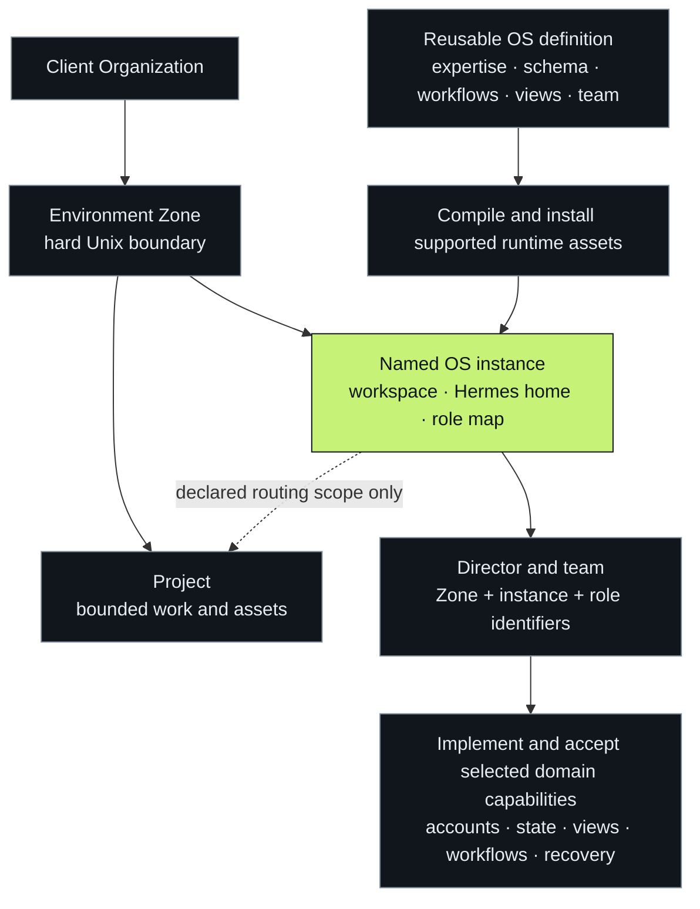
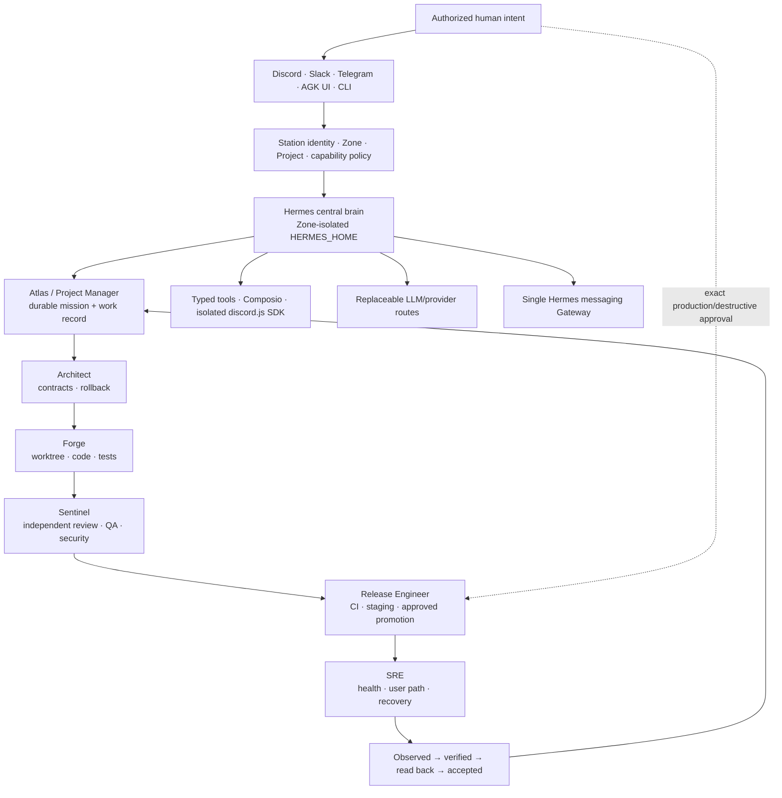

# Chief AI Officer AIOS — Agentik Station Atlas

This is the operator's end-to-end map of Agentik Station: what every major part is, where it lives, who controls it, how Hermes connects it, how an Operative System is built and installed, how Discord becomes the human cockpit, and how the DevOps team executes work safely.

The Atlas describes Station software release `11.20`; individual OS/resource packages retain their independently reviewed versions. It separates implemented repository behavior from external setup that still needs real credentials and readback. Start here, then use `ARCHITECTURE.md`, `SECURITY.md`, `INSTALL.md` and `SETUP.md` for the normative details.

**Visual companion:** the [README system maps](README.md#the-whole-system) explain
the full topology, VPS install, OS factory, chat enrollment, filesystem and evidence
loop with self-contained animated SVGs and text alternatives. They describe
architecture, not live telemetry. The [VPS workflow review](docs/audit/2026-09-05-vps-workflow-review.md)
records repaired bootstrap defects and the remaining OS-instance/routing and
resumability decisions. Begin a fresh Host with
`./bootstrap.sh --mode full --with-ai-stack --plan`; see [INSTALL.md](INSTALL.md)
for confirmation, exact-spec apply and the boundary of kernel rollback.

**Current operating entry point:** `sudo station setup --json` reads local bootstrap,
Organization/Zone/instance evidence and returns dependency-ordered next steps. Use
`station organization register` only for existing matching client Zones,
`station os instance install` for a named client-owned runtime without a mandatory
Project, `station os instance setup` for its mapped Director's provider login,
and `station platform … --instance` for its gateway. `station project create`
provisions separate work assets without rerunning the Host installer. The [first-mission guide](docs/operations/06_FIRST_MISSION.md)
contains the exact order and repair boundaries.

## 1. The system in one sentence

Station is the governed Linux control plane; Hermes is the Zone-isolated agent execution brain; an OS is the installable operating contract Hermes runs; model providers supply replaceable cognition; tools perform bounded actions; Discord and Agentik UI are human surfaces; evidence decides whether the result is truly done.

```text
Human intent
  │
  ├── Discord / Agentik UI / CLI / API
  │
  ▼
Station policy + identity + desired state
  │  resolves Organization → Host/Zone → OS instance → mission → capabilities
  │  selects Project scope only when the work requires it
  ▼
Hermes execution fabric (instance homes inside the owning Zone's UID boundary)
  ├── Nano Director profile
  ├── specialist profiles / Bot Mode / delegated workers
  ├── sessions + Kanban + mission graph
  ├── Skills + plugins + hooks + cron
  ├── model-provider routes
  ├── MCP / Composio / native tools / direct APIs
  ├── workspaces + Git worktrees
  └── memory + logs + learning candidates
  │
  ▼
Real systems and Project code
  ├── GitHub / repositories / CI
  ├── Vercel / Convex / Clerk / Stripe
  ├── Discord and other messaging platforms
  ├── ScrapeGraphAI / Playwright / Langfuse / Honcho / Hindsight / Crawl4AI
  └── Hosts / containers / services / TigerVNC
  │
  ▼
Observed result → verification → external readback → evidence → acceptance
```

## 2. Who is in control

The phrase “Hermes is the central brain” means Hermes coordinates runtime execution. It does not mean one global, all-powerful bot owns every secret.

| Layer | Owns | Must not own |
|---|---|---|
| Station | constitution, desired state, isolation, placement, capability policy, releases, receipts and evidence gates | free-form model reasoning or every provider's implementation |
| Organization | its client environment Zones, OS instances, Projects, accounts and operating data | another client's state or reusable package secrets |
| Zone | one operational/security boundary, Unix identity, HERMES_HOME, credentials, memory, logs and runtime state | another Zone's data or accounts |
| OS instance | configured domain capability, workspace, mapped team, runtime, connected-account scope and evidence | the Organization itself or every Project by default |
| Project | repos, docs, knowledge, resources, workspaces, worktrees, artifacts and evidence | global Station policy or unrelated Project data |
| Hermes | sessions, profiles, Bot Mode, delegation, Skills, plugins, tools, provider routing, gateway, memory and mission execution | self-authorized privilege or Station's source of truth |
| Nano Director | one OS outcome and its mission graph | unlimited Host access or automatic production approval |
| LLM provider | cognition for a routed task | identity, authority, durable truth, secret storage or deployment ownership |
| Capability/tool | one typed action against a declared target | policy decisions outside its input contract |
| Discord | human interaction and semantic status projection | canonical state, secrets or recursive bot-to-bot orchestration |
| Evidence | proof of what was observed and accepted | credentials or unverifiable claims |

The power comes from this split. Hermes can use many providers and tools without giving any one provider the keys to the whole Station. A provider can change while the Zone, mission, permissions, state and audit trail remain stable.

## 3. Canonical vocabulary

- **Station** — the complete governed environment across one or more Hosts.
- **Host** — one Linux machine or VPS running the Station kernel.
- **Control Plane** — desired state, registries, bindings, placement, releases and evidence indexes.
- **Zone** — the only canonical operational/isolation boundary. Each Zone has its own Unix identity and HERMES_HOME.
- **Project** — the owner of one body of source, knowledge, resources, integrations, credentials, execution spaces and evidence.
- **Operative System (OS)** — a governed domain operating capability across definition, runtime, connected capabilities, and state/evidence/interfaces. Its reusable package is not merely the team or a computer operating system.
- **OS instance** — the client's configured runtime of an OS definition in one environment Zone; owns a domain workspace and may serve declared Projects.
- **Nano Director** — the persistent Hermes profile accountable for one OS outcome.
- **NanoTeam** — the persistent specialists and bounded workers coordinated by the Nano Director.
- **Mission** — durable work with an objective, graph, owners, gates, state and evidence.
- **Skill** — reusable procedural expertise invoked by Hermes/profile policy.
- **Program/workflow** — deterministic or graph-based execution logic.
- **Capability** — an allowlisted action such as repository read, Discord plan, staging deploy or evidence write.
- **Connector/provider** — the adapter to an external model, app, platform or API.
- **Workspace/worktree** — a temporary, isolated execution area for a mission branch.
- **Resource** — a reviewed reusable dependency, component source, icon library, recipe or asset.
- **Evidence** — durable proof attached to a claim.
- **Fleet** — all Station Hosts and their Zone placements.

## 4. The clean `station` filesystem

Everything belongs to the Station namespace, but it is deliberately not placed in one physical directory. Linux code, configuration, mutable state, logs, secrets and backups have different permissions and lifecycle needs. `/srv/station` is the clean human entry point; the other roots are its governed backing layers.

```text
/etc/station/                    desired state and approved policy
├── station.json
├── station.yaml
├── hosts.d/
├── zones.d/
├── organizations.d/             protected ownership for existing client Zones
├── policies.d/
└── bindings.d/

/opt/station/                    immutable software
├── releases/<version>/          exact repository release
├── current -> releases/<version>
├── .staging/<operation>/
└── tools/hermes/current/        shared Hermes executable code

/srv/station/                    human-operational entry point
├── README.md
├── 1_CONTROL/                   generated navigation, never canonical state
├── 2_ZONES/
│   ├── 1_SYSTEM/
│   ├── 2_PRIVATE/
│   ├── 3_AGENTIK/
│   ├── 4_ORGANIZATIONS/
│   ├── 5_PROJECTS/
│   ├── 6_FACTORY/
│   └── 7_LAB/
├── 3_SHARED/
│   ├── packages/
│   ├── schemas/
│   ├── assets/
│   ├── cache/
│   └── resources/               pointer to reviewed release resources
└── 4_ARCHIVE/

/var/lib/station/                durable mutable machine/runtime state
├── system/
├── receipts/
├── observed/
├── registry/
│   ├── os-instances/<zone>/<instance>.json  schema-3 instance ledger
│   └── os/<zone>/<os>.json       legacy Project-bound ledger
├── doctor/
└── zones/<zone-id>/
    ├── home/
    ├── hermes/                  Zone-base/legacy Hermes home
    ├── os-instances/<instance>/hermes/  instance-specific Hermes home
    ├── mission-state/
    ├── databases/
    ├── connector-state/
    ├── caches/
    └── projects/

/var/log/station/                system and Zone logs
/var/backups/station/            local recovery staging
/run/station/                    ephemeral locks, sockets and runtime files
```

Source-of-truth rules:

1. `/etc/station` says what should exist.
2. `/var/lib/station` records what exists and what happened.
3. `/opt/station/releases` contains immutable executable history.
4. `/srv/station` is the operator-friendly view and contains human Project assets.
5. Secrets never enter Git, `1_CONTROL`, Discord messages, evidence or shared release code.

## 5. Client, OS instance and Project anatomy

The business hierarchy is **Organization → Macro Domain → Domain → OS**. Its
deployment is not “client inside Project”: client environment Zones contain
**OS instances and Projects as siblings**. A reusable package can be installed for
different clients without sharing their runtime, tokens, sessions or raw memory.



The map describes contracts, not live status. Instance installation does not
automatically generate every domain app/database/workflow in the definition.
Same-Zone instances and Projects share a UID; the declared Project list is not a
filesystem sandbox. See [the complete instance contract](docs/organization/05_OS_INSTANCES.md).

A Zone is the security envelope:

```text
Zone
├── declared owner, organization, environment and Host placement
├── dedicated Unix user/group
├── dedicated HERMES_HOME
├── dedicated credentials, memory, logs, state, run and backup roots
├── Projects
├── installed OS instances
├── integrations and connector bindings
└── Doctor, evidence and recovery contract
```

A Project is the work envelope:

An OS instance has its own `<zone>/os/instances/<instance>/workspace` and
`<zone-state>/os-instances/<instance>/hermes`. Root authority is the schema-3 ledger
under `/var/lib/station/registry/os-instances/<zone>/<instance>.json`; its
`role_profile_map` resolves every canonical role to the native instance ID.
Instance Hermes homes separate Hermes configuration and sessions; gateways retain
the Zone's canonical Unix `HOME`. Other CLI authentication and caches under that
home may be shared within the Zone; this is not per-instance account isolation.
Project code remains separately owned in the tree below.

```text
<zone>/projects/<project-id>/
├── PROJECT.json / PROJECT.yaml
├── README.md
├── .station/STATION_AGENT_RULES.md
├── AGENTS.md / CLAUDE.md / GEMINI.md
├── repos/                       Git repositories only
├── docs/                        Project documentation
├── knowledge/                   approved domain knowledge
├── resources/                   selected catalog resources/decisions
├── integrations/                non-secret integration declarations
├── credentials/                 scoped references/material, mode 0700
├── workspaces/                  temporary mission environments
├── worktrees/                   parallel Git worktrees
├── state/                       human-facing state references
├── artifacts/                   build and generated deliverables
├── evidence/                    Project evidence
└── ops/                         runbooks and operational controls
```

Local and remote are only placement. `organization-alpha-dev` can run on the core Host while `organization-alpha-prod` runs on a dedicated Host; both keep the same Zone contract.

## 6. Universal rules for Hermes and every LLM CLI

The canonical rules are `rules/STATION_AGENT_RULES.md`; `config/agent-runtime-policy.json` is the machine-readable routing policy.

Entry points:

| Executor | Instruction entry point |
|---|---|
| Hermes profile | rules embedded in generated `SOUL.md` plus `STATION_RULES.md` |
| Codex | root/project `AGENTS.md` |
| Claude Code | `CLAUDE.md` → canonical rules |
| Gemini CLI | `GEMINI.md` → canonical rules |
| GitHub Copilot | `.github/copilot-instructions.md` → canonical rules |
| Other CLI/agent | `.station/STATION_AGENT_RULES.md` |

Install the same managed rules into an existing Project repository without deleting its local instructions:

```bash
station rules install --repo /srv/station/2_ZONES/<category>/<zone>/<env>/projects/<project>/repos/<repo> --plan
station rules install --repo /srv/station/2_ZONES/<category>/<zone>/<env>/projects/<project>/repos/<repo>
```

The installer appends one marked, idempotent adapter block and preserves existing agent instructions. Run the write command as the owning Zone/Project user, never root.

Every executor follows the same order:

```text
resolve Organization/Host/Zone/instance/environment/principal, plus Project/repo when needed
→ inspect current state
→ Plan First
→ select allowlisted capabilities
→ create/use the owning workspace or worktree
→ implement
→ test + Doctor + independent review as required
→ external readback when a real system changed
→ record evidence and repair action
→ accept only after all gates pass
```

These rules follow the standard repository instruction hierarchy used by Codex; see the official [AGENTS.md guidance](https://learn.chatgpt.com/docs/agent-configuration/agents-md).

## 7. Hermes as the central execution brain

Station installs one reviewed Hermes codebase in `/opt/station/tools/hermes/current` and exposes `/usr/local/bin/hermes`. It never gives all organizations one global Hermes home. Every Zone invokes the same engine with different identity and state:

```text
runuser --user <zone-unix-user> --
  HOME=<zone-state-root>/home
  HERMES_HOME=<zone-state-root>/os-instances/<instance>/hermes
  XDG_RUNTIME_DIR=/run/user/<zone-uid>
  /usr/local/bin/hermes --profile <mapped-native-role> <action>
```

That design provides:

- one engine to maintain and update;
- isolated credentials, profiles, sessions, memory and bot state;
- stable missions even when an LLM provider changes;
- a common bot protocol across Discord, Slack, Telegram and other surfaces;
- native delegation between OS teams without public bots talking in loops;
- consistent Skills, tool filtering, logging, Doctor and evidence hooks.

Use Station's `--instance`/optional `--role` selectors to obtain this mapped
invocation; never guess the native profile name. Zone-base/legacy commands retain
their separate home. Instance separation does not add a Unix sandbox within a Zone.

Hermes maps Station concepts this way:

| Station concept | Hermes runtime primitive |
|---|---|
| Nano Director | persistent profile/Bot |
| NanoTeam specialist | persistent profile or delegated worker |
| mission | session + durable mission/graph state |
| task queue | Kanban/work items |
| ordered expertise | Skills |
| deterministic action | Program/tool/plugin |
| provider choice | model/provider route |
| app connector | native tool, MCP, Composio or typed API adapter |
| schedule | cron/automation |
| coding branch | Project worktree/workspace |
| public bot surface | Hermes Messaging Gateway |
| memory | Zone/profile-scoped memory provider |
| improvement | reviewed learning candidate, never silent policy mutation |

## 8. How an Operative System is built

Canonical editable OS source lives only in `os/<os-id>/`. A generated Hermes distribution is a disposable artifact, never a second source tree.

Every AGK OS v2 defines:

```text
outcome contract
+ Nano Director
+ NanoTeam profiles
+ ordered Skills
+ deterministic programs
+ capabilities and integrations
+ knowledge and memory scope
+ data and mission schemas
+ provider routes
+ workflows and automations
+ governance and engineering harness
+ evaluations and evidence
+ Discord surface and views
+ Doctor
+ update, rollback and recovery
+ self-improvement policy
+ Librarian handoff
+ deployment and orchestration
+ Hermes distribution template
```

For the DevOps OS this is now executable, not only descriptive. The semantic
spine is `os/devops/semantics/CONTRACT.json`; it binds the six identities to
typed programs, tool contracts, provider routes, the closed workflow state
machine, Discord controls, evaluation scenarios and an exact recovery artifact
checksum. `os/devops/programs/runner.py` performs deterministic package and
evidence validation plus read-only drift reporting. Station Doctor fails closed
if any required semantic file, route, transition, role contract, Librarian input
or recovery hash is missing.

The build path is:

```text
Request for a new/updated OS
  ↓
Librarian OS
  ├── maps the topic and terminology
  ├── reads canonical books/reference material
  ├── checks current primary web sources
  ├── gathers expert/operator knowledge
  ├── finds contrarian/failure evidence
  ├── scores provenance and contradictions
  └── produces the structured Builder handoff
  ↓
Builder OS
  ├── locks outcome and boundaries
  ├── designs director/team/topology
  ├── orders Skills and capabilities
  ├── defines workflows/data/evidence
  ├── defines Discord/Doctor/recovery
  ├── implements contracts and source
  ├── runs tests, Gauntlet and independent review
  └── publishes a versioned canonical package
  ↓
Station OS compiler
  ├── validates AGK OS v2 source
  ├── compiles every profile distribution
  ├── binds instance workspace, role mapping, declared Project scope and universal rules
  └── emits COMPILED_NOT_INSTALLED
  ↓
Client-owned instance installation
  ├── namespaced Hermes profile install in that instance's HERMES_HOME
  ├── provider/credential enrollment
  ├── Discord/connector binding
  ├── Hermes and plugin Doctor
  └── fresh-session + external readback acceptance
```

Repository OS packages currently include Station Maintainer, Discord Bootstrap, Fleet Operator, Builder, Librarian and DevOps. Query them with:

```bash
station os catalog
station os doctor --all
station os compile --id devops-os --project-root /absolute/project --output /new/output
sudo station os instance install --id devops-os --zone <zone-id> --instance engineering --organization <client-id>
sudo station os instance setup --zone <zone-id> --instance engineering
sudo station os instance verify --zone <zone-id> --instance engineering
sudo station os instance show --zone <zone-id> --instance engineering
```

Compile is not install; install is not external acceptance; profile Doctor is not Discord/deployment readback.

The low-level `os compile --project-root` remains a package/compiler interface;
new instance installation owns its runtime mapping. The full locked OS spans
durable domain schema/state, useful views, workflows, connected capabilities,
governance and recovery. Each selected capability still needs an implementation
and acceptance; creating profiles alone does not materialize every declared plane.

Legacy `station os install/setup/verify` and platform `--os` remain schema-2
Project-bound commands. No profile, account, token or ledger is automatically
migrated into a new instance.

## 9. End-to-end mission flow

Example: “deploy the application” arrives in the DevOps Discord channel.

1. The Hermes gateway receives the Discord event inside the owning Zone.
2. Immutable guild/channel/user bindings resolve the Organization, Zone, instance and mapped Director, plus the Project when this mission requires it.
3. Authorization checks the human principal, channel and requested capability.
4. Atlas creates or resumes the Hermes session and durable Station mission.
5. Atlas clarifies target environment and acceptance; production is denied unless explicitly approved.
6. Atlas writes a Plan First graph and projects a semantic Mission Progress Card to Discord.
7. Architect inspects architecture and defines the change/recovery contract.
8. Forge works in the Project repository/worktree, implements and tests.
9. Sentinel independently reviews security, quality, negative paths and claim accuracy.
10. Release Engineer verifies pins, locks, CI and reproducible artifacts; it deploys staging or an approved production release.
11. SRE verifies service and user-path readback, observes health and records rollback coordinates.
12. Atlas accepts only if every required gate passed; otherwise it reports `BLOCKED`/`DEGRADED` with a next action.
13. Discord receives the concise result; detailed evidence remains in Station/Project evidence, not in public chat.

This flow is the same if the initial surface is Slack, Telegram, browser chat, Agentik UI, API or CLI. The platform is an ingress/egress adapter; Hermes and Station retain orchestration and truth.

## 10. Capability and tool resolution

Hermes selects the smallest approved mechanism in this order:

1. existing Project/Station code;
2. Hermes-native profile, Skill, plugin, hook, gateway, memory or worktree capability;
3. operating system or standard-library function;
4. reviewed installed dependency;
5. MCP or Composio connected capability;
6. typed direct API adapter;
7. the smallest justified new implementation.

Each capability has a scope, principal, input contract, output contract, permission policy, timeout/retry behavior, evidence and failure state. “The model knows how” never grants permission.

Optional AI components have distinct jobs:

| Component | Job in Station | Control boundary |
|---|---|---|
| Ponytail | Hermes/engineering plugin for focused YAGNI coding | pinned plugin; enabled only for suitable profiles |
| Langfuse | LLM traces, observability and evaluations | self-host/cloud enrollment, keys, retention and trace readback required |
| Honcho | stateful agent memory SDK | isolated Python environment and Zone-scoped store/account |
| Hindsight | learning/recall memory provider | bind per Zone/profile; verify recall and cross-Zone denial |
| ScrapeGraphAI | structured AI web extraction | default Hermes HTML tool, Zone OpenAI key, public-IP and redirect policy |
| Crawl4AI | HTML-to-Markdown extraction | default explicit fallback, no LLM key, same public-IP/redirect policy |
| TigerVNC | private remote graphical session when needed | private network, authentication, firewall and viewer readback |
| Composio | scoped connected-account capability plane | stable principal plus explicit toolkit/account allowlist |

Use `station deps list` and install only declared components. `--with-ai-stack` stages all of them but does not authenticate, expose or accept them.

## 11. Resource catalog and the preferred product stack

The source catalog is `resources/CATALOG.json`. In an installed release its canonical read-only location is `/opt/station/current/resources`; `/srv/station/3_SHARED/resources` points operators there. A Project's `resources/` directory records what that Project selected.

```bash
station resource list
station resource show --id shadcn-ui
station resource show --id lucide
station resource show --id discord-js-sdk
station resource stack-plan --id web-product
```

The preferred `web-product` stack is:

| Resource | Role |
|---|---|
| Next.js + React | application, rendering and route/runtime structure |
| Convex | reactive backend, durable application state and server functions |
| Clerk | user identity, sessions and application authorization integration |
| Stripe | payments, subscriptions and billing events |
| Vercel | build/deployment/preview delivery |
| Tailwind CSS | styling primitives |
| shadcn/ui | accessible, Project-owned component source |
| Lucide | default semantic React icons |
| discord.js 14.27.0 | isolated typed SDK for a reviewed Discord extension; never another Gateway |

The `shadcn` CLI is installed in the pinned operator toolchain. shadcn components and `lucide-react` remain Project dependencies: they are added inside the owning repository, reviewed and committed there. A global CLI is not Project configuration.

The stack is open. Python services, mobile apps, Rust, Go, another database, another identity provider or another deploy target are allowed when the Project declares exact versions, data/secret ownership, verification, operations and rollback. The catalog is a reviewed default, not vendor lock-in.

External setup remains explicit:

- Vercel project/team link and least-privilege login;
- Convex deployment/project enrollment and keys;
- Clerk application, environment keys and webhook verification;
- Stripe test/live separation, webhook signing secret and event readback.

Never put these keys in the resource catalog, repository or Discord.

Hermes is the only bot protocol and messaging Gateway. The isolated
`discord.js` resource exists for typed API extensions that Hermes/Station
explicitly calls; it may not log in as a second concurrent bot. Composio
Discord is another Zone-scoped tool adapter for selected actions, not ingress,
session ownership or orchestration.

## 12. Discord architecture

Discord is the organization cockpit. Hermes supplies the gateway/session primitive; Station supplies Zone isolation, identity bindings, desired topology, capability policy, mission semantics and evidence gates.

### Safe bootstrap boundary

A bot token is a secret and the Discord server owner controls guild authorization. The safe base flow is:

```text
1. Human owner creates the Discord application and bot in the Developer Portal.
2. Human owner configures required intents and obtains/rotates the token.
3. Human owner authorizes the application to the target guild with OAuth2.
4. Prefer explicit create/manage/view/send permissions.
5. If initial topology truly needs it, owner grants temporary Administrator
   for a declared maintenance window.
6. Operator runs the owning Zone's Hermes setup and enters the token there.
7. Bootstrap Director inventories the existing guild.
8. It compiles desired state from organization + installed OS declarations.
9. It shows an adopt-and-extend plan; deletes are denied by default.
10. It creates/updates roles, categories, channels, overwrites and commands.
11. It stores immutable Discord IDs in Zone connector state.
12. It verifies routes, commands and message/interactions readback.
13. Human owner removes temporary Administrator/elevated role.
14. Station reads back the new role state and tests runtime least privilege.
15. Evidence is recorded; only then may the surface be accepted.
```

Use the Zone-isolated wizard:

```bash
sudo station platform setup --zone <zone-id> --instance engineering --platform discord --plan
sudo station platform setup --zone <zone-id> --instance engineering --platform discord
sudo station os instance verify --zone <zone-id> --instance engineering
sudo station platform install --zone <zone-id> --instance engineering
sudo station platform start --zone <zone-id> --instance engineering
sudo station platform status --zone <zone-id> --instance engineering
sudo station platform doctor --zone <zone-id> --instance engineering
```

Tokens are entered only through Hermes' interactive setup, never as a command argument. Discord's official documentation treats bot tokens like passwords and applies permissions at guild authorization; it also documents role hierarchy limits. See [OAuth2 and permissions](https://docs.discord.com/developers/platform/oauth2-and-permissions) and [server/channel management](https://docs.discord.com/developers/platform/server-and-channel-management).

Important limitation: a guild bot token cannot mint all the separate Discord applications and secret tokens required by a “one default Director bot per instance” topology. Humans create and authorize those applications/tokens unless a separately governed control plane is introduced. Internal specialist profiles normally stay behind the OS Nano Director, so they do not each need public bots.

The default is one Director surface **per instance**. For a justified specialist
surface, `station platform setup --zone <zone-id> --instance engineering --role forge
--platform discord` selects the mapped Forge role. It does not authorize topology,
mint a token or validate permissions. Enroll a separate intended identity and prove
its route, scopes and restart behavior; do not share one token across concurrent gateways.

### Bot-guided secure setup after bootstrap

The first bot token and Tailscale enrollment are necessarily human-owned. Once both exist, the `discord-bootstrap` SYSTEM Zone runs a loopback-only setup broker and Tailscale Serve exposes only its `/station-setup` path to the tailnet:

```text
authorized Discord interaction
  → ephemeral “Open secure setup” SDK button
  → HTTPS MagicDNS .ts.net URL, maximum 15-minute TTL
  → one-time token (only SHA-256 stored)
  → allowlisted key form, Hermes configuration, Composio Connect Link,
    or GitHub/Vercel/OpenAI/Discord device authorization
  → credential written only to the owning Zone's mode-0600 Hermes state
  → gateway/provider Doctor and external readback
```

Enable it after Tailnet enrollment:

```bash
sudo ./scripts/station_guided_setup_enable.sh
```

The broker never accepts a secret through Discord content, never places a key in argv or the session record, suppresses URL logs, rejects symlinks, restricts redirects, and consumes each link once. Tailscale ACLs plus the ephemeral response restrict delivery; the URL itself remains a bearer capability and must not be forwarded. Composio Connect Links enter through an owned mode-0600 file or in-process adapter, not a process argument.

The `station.guided_setup` card schema is platform-neutral. Discord has the implemented SDK-button renderer; Slack/Telegram/other Hermes surfaces can render the same action while keeping their own authorization and readback gate. Until those live renderers are accepted, use the native Zone-isolated Hermes gateway wizard on those platforms. Full protocol and threat model: [`docs/dependencies/VOICE_AND_GUIDED_SETUP.md`](docs/dependencies/VOICE_AND_GUIDED_SETUP.md).

### Base desired server structure

```text
00_CONTROL
├── command-center             operator entry and routing
├── approvals                  explicit human gates
└── system-status              concise health/readiness

<OS categories generated from installed manifests>
├── <os-primary-channel>       dedicated Nano Director surface
└── optional mission threads   conversation/session boundaries

40_ENGINEERING
├── devops                     Atlas / DevOps OS
├── qa                         verification summaries
└── deployments                release and readback summaries

90_SYSTEM
├── evidence                   sanitized evidence links
├── incidents                  SRE/incident coordination
└── node-health                Host/Fleet observations
```

One channel maps to stable guild/category/channel/role/application/bot IDs in:

```text
/var/lib/station/zones/<zone-id>/connector-state/discord/bindings.yaml
```

Names may change; IDs drive routing. Existing servers use adopt-and-extend. Unknown roles/channels are not deleted or renamed by default.

### Current implementation truth

Release 11.12 has a Zone-aware Hermes gateway wrapper, Discord binding validation, a host-owned message create/edit/read transport and a plan-first Discord Experience plugin. The full role/category/channel/command provisioner has not yet passed real test-guild create/edit/interaction/permission/readback acceptance. It is `INSTALLABLE`, not `OPERATIONAL`. The desired bootstrap workflow above is the acceptance target, not a false claim that every step already ran.

## 13. Hermes multi-platform bot protocol

Discord is one adapter. The same Zone-isolated Hermes Messaging Gateway can connect Telegram, Slack, WhatsApp, Signal, SMS, Email, Home Assistant, Mattermost, Matrix, DingTalk, Feishu/Lark, WeCom, Weixin, BlueBubbles/iMessage, QQ, Yuanbao, Microsoft Teams, LINE, ntfy and browser chat.

For any supported platform:

```bash
sudo station platform setup --zone <zone-id> --instance engineering --platform <platform>
sudo station platform install --zone <zone-id> --instance engineering
sudo station platform start --zone <zone-id> --instance engineering
sudo station platform status --zone <zone-id> --instance engineering
sudo station platform doctor --zone <zone-id> --instance engineering
```

Each connector still needs its own human/account enrollment, allowed users/channels and bidirectional message readback. Hermes makes platforms easy to attach; it does not erase each platform's security model.

### Voice is part of the same Hermes session

Voice is an input/output transport, not a second agent brain. Station installs Hermes' explicit voice and messaging dependencies and seeds each new Zone with:

```text
STT primary: OpenAI gpt-transcribe
STT Discord failover: local Parakeet v0.8.0 on 127.0.0.1:5092
TTS: OpenAI gpt-4o-mini-tts, voice alloy
```

The OpenAI key stays in the owning Zone. Parakeet is local ASR/STT, not TTS; its reviewed int8 image is pinned by digest, read-only, capability-dropped and resource-limited. A Discord audio message is first transcribed through the selected OpenAI path; if that request fails, only that Discord path retries through local Parakeet. The transcript then enters the same Hermes session, OS Director and mission graph as text. Voice becomes `OPERATIONAL` only after paid OpenAI STT/TTS, forced Parakeet fallback, Discord voice-note/channel and restart readback all pass.

## 14. DevOps OS team map

The DevOps OS uses Hermes as its coordination fabric and exposes Atlas as its public Nano Director.



Standalone source: [`docs/diagrams/16_DEVOPS_OS_END_TO_END.mmd`](docs/diagrams/16_DEVOPS_OS_END_TO_END.mmd).

| Member | Owns | Typical outputs | Cannot self-authorize |
|---|---|---|---|
| Atlas, Nano Director | scope, Plan First graph, capability routing, mission truth, evidence and acceptance | mission plan, assignments, status card, final decision | production/destructive authority, failed-gate waiver |
| Architect | architecture, interfaces, ADRs, dependency/recovery design | design, risks, contracts, migration/rollback plan | production apply or self-certification |
| Forge | implementation, migrations and local tests in the owning worktree | focused diff, tests, implementation handoff | accepting its own work or default production access |
| Sentinel | independent security, quality, negative/adversarial verification | findings, gate decision, regression requirements | silent threshold changes or hidden waivers |
| Release Engineer | pins, locks, manifests, CI, artifacts, staging, approved promotion | reproducible release, CI/deploy receipts, rollback coordinate | inferred production approval |
| SRE | runtime health, external readback, incidents, runbooks and recovery | health/readback evidence, incident timeline, recovery result | silent destructive recovery or health from process presence alone |

The normal graph is:

```text
Atlas clarify
  → Architect design
  → Atlas plan/authorize capabilities
  → Forge implement/test
  → Sentinel independent gate
  → Release Engineer package/CI/stage/approved promote
  → SRE runtime and user-path readback
  → Atlas evidence-backed acceptance
```

Safe non-overlapping research, test and implementation branches may run in parallel, but each branch has an owner and verification owner. Shared mutable code uses separate Project worktrees and an explicit integration gate.

Provider routing is role-based and model-agnostic: high-reasoning routes for Atlas/Architect, task-fit coding for Forge, an independent review route for Sentinel, release-task-fit for Release Engineer and operations-task-fit for SRE. If an approved provider fails, Hermes routes to another approved provider or marks the node blocked; it never silently expands permissions.

The 17 familiar specialties remain available as capability aliases. Product
Manager, Meeting Intake and Platform Lead route to Atlas; Tech Lead and Designer
route to Architect; Product/Frontend/Backend Engineering route to Forge;
QA/Visual QA/Security route to Sentinel; CI/CD and Release Manager route to
Release Engineer; Infrastructure/SRE/FinOps route to SRE. This keeps ownership
clear while avoiding 17 independent agents competing for state.

Client delivery uses `agk-work-tracker/v1`: the AGK durable work record is
canonical, Linear is the default adapter, and GitHub Issues/manual adapters can
be selected by contract. The legacy automated client controller remains
Linear-first. Normal work uses the compact view; regulated work exposes every
QA, security and release state. Both enforce the same gates. Default autonomy
is `decide → act → verify → record → continue`; `BLOCKED` is legal only when no
useful path remains and records blocker, attempts, impact, need and exact resume
point. Corrections always reuse the same issue, branch, PR and Hermes session.

The legacy controller's client tree also owns `.client/operations.yaml`. It closes the operational gap
between “code merged” and “service owned”: service catalog, environment/data
classification, pipelines and artifact identities, SLI/SLO/error budgets,
alerts, incidents/on-call/postmortems, encrypted off-Host backup with RPO/RTO
and restore rehearsal, dependency/vulnerability/license policy, cost controls,
access reviews, offboarding, ADRs and runbooks. This controller is a separate
compatibility workflow, invoked explicitly via `station client --legacy …` or
direct bundled `agk client …`. It creates `~/workspace/clients` and `~/.hermes`
profiles under the operator identity. It does **not** register canonical client
Zones, install first-class instances or provide separate client Unix identities.
Its TUI/Fleet views are not automatically schema-3 instance-registry-aware.
Preserve existing data; prefer Organization/instance commands for new enrollment.

## 15. GitHub, Vercel, Composio and external tools

Tool installation, authentication, authorization and successful action are separate states.

```text
binary present
→ correct pinned version
→ correct account/principal authenticated
→ required repository/project/account selected
→ least-privilege scope verified
→ safe probe observed
→ real action read back
→ accepted for that Zone/Project
```

- **GitHub CLI** — repository and CI operations; `gh auth login` and `gh auth status` are operator-owned. Repositories stay under Project `repos/`.
- **Vercel CLI** — project/team deployment; `vercel login` and `vercel whoami` do not replace Project link and deploy readback.
- **Composio CLI** — connected capability setup; use stable Station principals and explicit toolkit/account allowlists. No generic global production principal. The Discord adapter uses `station:<organization-or-personal>:<zone>:atlas`, default-deny execution and mutation readback.
- **discord.js SDK** — exact 14.27.0 package/lock installed under `.local/share/station-sdk/discord-js`; no token, bot process or Gateway is created by the resource.
- **Codex/Claude/Gemini** — coding cognition/execution clients governed by repository rules; they do not become Station authority.
- **Model APIs** — provider routes are scoped per profile/mission. Keys remain in Zone/Project credential mechanisms.

Check the toolchain:

```bash
station deps toolchain-plan
sudo station deps toolchain-install
station deps toolchain-check
station provider status
station provider composio-discord plan --zone <zone-id>
sudo station provider composio-discord link --zone <zone-id>
sudo station provider composio-discord verify --zone <zone-id>
# Legacy shared-operator controller only; not instance verification:
station client --legacy doctor <client-id> --online
```

## 16. Fresh Host installation: exact path

### A. Prepare and inspect

On a supported fresh Ubuntu/Debian systemd Host:

```bash
git clone https://github.com/agentik-os/agentik-station.git
cd agentik-station
./station doctor --repo
./station plan --host-id station-core-01 --role core
```

### B. Install

Full Operator Station:

```bash
sudo ./bootstrap.sh --mode full
```

Full Operator Station plus all optional AI components:

```bash
sudo ./bootstrap.sh --mode full --with-ai-stack
```

Organization/team Host:

```bash
sudo ./bootstrap.sh --mode team --organization organization-alpha --project platform
```

Bootstrap creates the dedicated `agk-station` operator, relocates source outside `/root`, installs pinned Python runtimes, Node/npm, GitHub CLI, Vercel CLI, Codex CLI, Composio CLI, shadcn CLI and the isolated discord.js SDK plus the signed stable Tailscale package, installs the reviewed Hermes version with voice/messaging dependencies, reconciles the Station FHS layout, creates declared Zones/Projects, starts local Parakeet, and starts the loopback setup broker. It publishes the broker through Tailscale Serve only when the Host is already enrolled; it never falls back to public exposure.

### C. Verify base state

```bash
station doctor --full
station status
station module status
station deps toolchain-check
```

The correct base result is `READY_FOR_SETUP`, not `OPERATIONAL`.

### D. Configure Project repositories and rules

Clone only under the owning Project `repos/`, then install the common rules as that Zone user:

```bash
station rules install --repo <absolute-project-repository> --plan
station rules install --repo <absolute-project-repository>
station resource stack-plan --id web-product
```

Review and apply the stack plan inside that repository if the Project chose it.

### E. Enroll external systems

1. enroll the Host in Tailscale and run `sudo ./scripts/station_guided_setup_enable.sh`;
2. have the human owner create and authorize the first Discord application/token;
3. start the `discord-bootstrap` Hermes gateway and verify bidirectional messages;
4. authenticate only required GitHub/Vercel/Composio/model principals, preferably through the bot's short Tailnet setup buttons after that point;
5. create and separate development/staging/production provider projects;
6. configure scoped credential references in the owning Zone/Project;
7. register existing matching client Zones and install selected OS instances with their own workspaces and optional declared Projects;
8. configure any additional Hermes platform gateways;
9. run provider-specific Doctor and safe read/write probes;
10. verify live voice/message/deployment/connector readback.

### F. Enable persistent automation last

Every cron, trigger or persistent bot starts disabled. Run a fresh session using only deployed configuration and durable state. Enable automation only after it passes, trigger it once and verify delivery/readback.

## 17. Hermes and dependency updates

Initial Hermes installation is pinned to a reviewed release/commit. The separate updater requests a native backup and records Doctor/gateway results:

```bash
station hermes check
station hermes update
sudo station deps enable-auto-update
```

The weekly timer is enabled by bootstrap unless explicitly skipped. Update flow:

```text
check upstream
→ record candidate
→ pre-update backup
→ apply native upstream update
→ Hermes Doctor and gateway observation
→ receipt
→ keep candidate or require reviewed state/code recovery on failure
```

The timer can advance Hermes beyond the initial repository pin; it is not a canary approval workflow. There is no supported automatic state-restore CLI in the pinned Hermes release. Automatic update does not automatically promote every OS or dependency. OS migrations, plugins, messaging platforms and external applications keep their own compatibility/readback gates. Version changes belong in `config/versions.lock` and resource recipes only after review.

Station releases themselves are immutable:

```text
/opt/station/releases/<version>
/opt/station/current -> releases/<version>
```

Rollback selects an already installed release, then requires full Doctor and runtime compatibility checks:

```bash
sudo station release rollback --to <version>
station doctor --full
```

## 18. Evidence, maturity and honest completion

Station uses two related truth systems.

Evidence ladder:

```text
PREPARED → OBSERVED → REPORTED → VERIFIED → READ_BACK → ACCEPTED
```

Maturity/readiness ladder:

```text
SPECIFIED → SCAFFOLDED → INSTALLABLE → CONFIGURED → VERIFIED → OPERATIONAL
                                                                    │
                                                                    └→ DEGRADED if it later fails
```

Examples:

- a generated command is `PREPARED`, not run;
- exit code zero is `OBSERVED`, not external readback;
- an agent report is `REPORTED`, not independent verification;
- local tests may make code `VERIFIED`, not a remote integration operational;
- a message ID alone is not bidirectional Discord acceptance;
- a deployment upload is not application/user-path readback;
- an installed memory client is not a Zone-isolated memory round-trip;
- copied OS source remains `NOT_INSTALLED` until compiled and installed;
- profile Doctor still does not prove Discord or provider acceptance.

Every failed or incomplete gate keeps the lower truthful state and records a concrete next repair action.

## 19. Recovery and incident behavior

On failure:

1. stop unsafe dependent nodes;
2. preserve the observed error and partial-operation receipt;
3. never pretend an external API sequence was transactional;
4. re-inventory current state instead of replaying assumptions;
5. use the documented rollback/recovery capability within its scope;
6. require a new Doctor and readback;
7. keep the module `DEGRADED` until the failed accepted behavior is restored.

Backups are useful only after a destructive restore rehearsal. Off-Host repository, encryption, retention, Zone inclusions/exclusions, credential rebinding and fresh-session acceptance are setup gates.

## 20. What is ready now and what still needs the real world

Repository-verified or implemented:

- typed plan/apply and SafeFS-based privileged reconciliation;
- immutable releases, receipts, Doctor and Zone/Project layouts;
- reviewed/pinned operator toolchain installer including shadcn CLI;
- reviewed Hermes install/update path with isolated Zone homes;
- canonical OS sources, source Doctor and Hermes profile compiler;
- client Organization registration and named OS instances with dedicated runtime homes, full native role maps and no mandatory Project;
- universal provider/CLI rule distribution;
- resource catalog and exact web-product stack plan;
- Hermes multi-platform gateway lifecycle wrapper;
- Composio binding plus default-deny Discord tool policy and guided link/readback commands;
- isolated, integrity-pinned discord.js SDK resource with no second Gateway;
- default read-only shared ScrapeGraphAI 2.2.2 and Crawl4AI 0.9.3 Python runtimes with Zone-local HOME/cache/credentials;
- `station_scrapegraph` extracts structured data via the Zone OpenAI key; `station_crawl4ai` is the explicit no-LLM Markdown fallback. Both consume guarded public HTML, with DNS-pinned connections, redirect checks and JavaScript disabled;
- the operator plugin and newly compiled OS profile distributions register these tools in Hermes's native `web` toolset; `sudo station deps web-check` verifies imports/pins and Chromium launch. Existing profile configuration must be re-enabled when preserved by Hermes updates. [Full web contract](resources/scrapegraphai/README.md);
- DevOps six-identity team, tracker-neutral workflow contract, typed tools/routes,
  deterministic programs, 15-source Librarian ledger, 12 adversarial evals,
  exact recovery checksum and client operations schema;
- CI coverage for Python 3.11/3.12/3.13, AGK components, Hermes Fleet build,
  discord.js lock, shell/identity hygiene and a scheduled disposable Ubuntu bootstrap.

External acceptance still required:

- a real fresh-VPS install/reboot and service readback;
- real Hermes profile/plugin/fresh-session acceptance;
- GitHub/Vercel/Composio/model-provider account/scoping probes;
- full Discord topology provisioning and interaction/permission readback in a test guild;
- each dedicated OS Discord application/token human enrollment;
- Langfuse/Honcho/Hindsight/TigerVNC runtime setup as selected and live Zone-scoped acceptance of both web tools;
- live OpenAI voice, Parakeet fallback and Tailnet guided-setup acceptance;
- rootless cross-Zone negative tests;
- remote Fleet drift/rollback acceptance;
- encrypted off-Host destructive restore rehearsal.

No document may promote those items to `OPERATIONAL` before their evidence exists.

## 21. Operator acceptance checklist

- [ ] Repository Doctor passes.
- [ ] Plan was reviewed before apply.
- [ ] Full Host Doctor passes after install/reboot.
- [ ] Every Zone has the expected Unix owner and independent HERMES_HOME.
- [ ] Every Project lives inside its Zone and every repo under `repos/`.
- [ ] Common Station rules are present in every executor entry point.
- [ ] Dependencies match the Project contract and reviewed pins.
- [ ] GitHub/Vercel/Convex/Clerk/Stripe/Composio principals are least-privilege and environment-specific.
- [ ] Each installed OS compiles, installs and passes Hermes/plugin Doctor.
- [ ] Discord applications/tokens were created and authorized by the owner.
- [ ] Temporary Discord elevation was removed by the owner and read back.
- [ ] Messaging passes inbound, outbound, unauthorized-user and restart tests.
- [ ] Tailscale setup links are private, expire/consume once, and leave no credential in chat, argv, logs, session state or evidence.
- [ ] OpenAI `gpt-transcribe` and `gpt-4o-mini-tts` pass a real Zone-scoped round-trip.
- [ ] A forced OpenAI STT failure proves Discord audio falls back to local Parakeet.
- [ ] DevOps work passes Architect → Forge → Sentinel → Release → SRE gates as applicable.
- [ ] Every client has a complete `.client/operations.yaml`; Blocked records contain all five fields and correction loops preserve their original context.
- [ ] Composio Discord is bound to the exact Zone principal, passes an approved read-only probe and cannot select another Zone account.
- [ ] No process besides the owning Hermes Gateway logs in the discord.js resource as a bot.
- [ ] Production actions have named human approval.
- [ ] Logs/evidence contain no secrets.
- [ ] Backup restore and rollback coordinates are known and tested.
- [ ] Persistent automations pass fresh-session acceptance before enablement.
- [ ] Module status and claims match observed evidence.

## 22. Canonical source map

- `AGENTS.md` — mandatory repository engineering contract.
- `rules/STATION_AGENT_RULES.md` — universal Hermes/LLM/executor rules.
- `config/agent-runtime-policy.json` — machine-readable executor/provider policy.
- `ARCHITECTURE.md` — normative system and filesystem architecture.
- `SECURITY.md` — threat model and security constraints.
- `INSTALL.md` — Host plan/apply contract.
- `SETUP.md` — external enrollment and acceptance gates.
- `docs/organization/05_OS_INSTANCES.md` — client ownership, definition/instance/Project distinction, role mapping and legacy boundaries.
- `config/versions.lock` — reviewed tool/dependency pins.
- `config/deps/stack.yaml` — optional AI dependency roles and maturity.
- `resources/CATALOG.json` — reusable resources and preferred stack recipe.
- `resources/discord-js-sdk/` — integrity-locked typed Discord SDK, never a Gateway.
- `modules/catalog.json` — module maturity claims and next actions.
- `os/CATALOG.json` — canonical OS packages.
- `os/librarian/` — research/intelligence OS.
- `os/builder/` — OS factory/compiler-design OS.
- `os/devops/` — engineering/release/operations team.
- `os/devops/semantics/CONTRACT.json` — executable DevOps OS semantic spine.
- `components/agk-tui/client/defaults/operations.yaml` — default client operational completeness contract.
- `config/composio/discord-tool-policy.json` — Zone-scoped, default-deny Discord tool policy.
- `os/discord-bootstrap/` — Discord desired topology/bootstrap contract.
- `src/agentik_station/` — safe Station kernel and runtime adapters.
- `runtime/hermes-station/` — Station-owned Hermes integration/plugin source.
- `tests/` and `factory/tests/` — contract, security, installer and Factory verification.
- `docs/history/` — provenance only; never current runtime truth.

When documents disagree, use this precedence: repository agent/security contracts, current canonical architecture/setup docs, machine-readable contracts and active code/tests; history comes last and cannot override current behavior.

## 2026-09-05: security mission and runtime-boundary corrections

Strix is a subordinate assessment capability of the existing **DevOps OS**, not a
new central brain. The same Atlas → Architect → SRE → Sentinel → Forge → Release
Engineer chain controls its scope, execution, independent verification and repair.
The human operator authorizes source disclosure and a disposable LAB environment.
Hermes remains responsible for sessions, routing, delegation, mission state and
chat. Discord, Telegram and Slack are interchangeable Hermes surfaces, not separate
security authorities. [Full team diagram and setup](resources/strix/README.md).

Concrete locations:

| Object | Location / owner |
|---|---|
| Canonical security resource | `resources/strix/`; reviewed pins in `config/versions.lock` |
| Canonical team | `os/devops/team/STRIX.json`; compiled as `STRIX_TEAM.json` |
| CLI and libraries | `/opt/station/tools/security/strix-1.6.1-py3.13.15/`; shared read-only software |
| Prepared source and disposable execution | `<Project>/workspaces/strix/<job>/`; owning LAB Zone UID |
| Dedicated key | `<Zone state>/credentials/strix-api-key`; `0600`, submitted through protected setup, never ambient Hermes `.env` |
| Approval | `/var/lib/station/security/strix/<zone>/<project>/<job>.json`; root-owned, expiring, Zone-group-readable |
| Summary | `<Project>/evidence/strix/<job>/summary.json`; never an automatic security acceptance |
| Instance distributions | `/opt/station/os-instance-distributions/<zone>/<instance>/<os>/<version>/`; root-owned immutable compiled source |
| Legacy Project-bound distributions | `/opt/station/os-distributions/<zone>/<project>/<os>/<version>/`; retained, not automatically migrated |
| Zone-readable binding | `/var/lib/station/zone-bindings/<zone>.json`; generated root-owned projection, not another editable source |

The OS compiler merges YAML structurally: each profile receives its mapped ID,
the instance workspace (or Project cwd for legacy distributions) and
`terminal.home_mode: profile`, with no duplicate `terminal`
mapping. Native distribution ownership includes command/research assets and the
DevOps security plugin. Cross-identity process launches clear inherited secrets.
Mixed system/Zone parent directories permit traversal (`0711`) while private
children and control data remain restricted. Linux acceptance tests must exercise
these paths as the actual Zone users, not merely as root.

ScrapeGraphAI remains the structured-extraction tool; Crawl4AI remains the no-LLM
Markdown alternative. DNS/network work is inside their 180-second worker deadline.
Temporary output stays in the Zone cache; fresh ScrapeGraphAI installation prewarms
its verified tokenizer assets. Real-library offline tests are distinct from paid
provider extraction and deployed Chromium/network acceptance.

The [deep audit](docs/audit/2026-09-05-station-deep-audit.md) explains remaining
design decisions: privileged operator scope, real policy enforcement, canary
updates, complete dependency locks and executable end-to-end acceptance. No count
of profiles, tools, documents or passing static checks substitutes for those gates.
