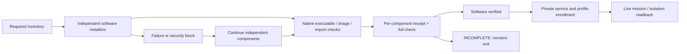

# The full Host software contract

Station 11.28 makes the full requested software stack the default Linux AMD64
Host installation. `--mode full` and `--mode team` choose topology; both select
the full software stack. `--with-ai-stack` remains a compatibility alias.
`--minimal` is an explicit partial installation, required for software skips.
The personal macOS/Linux Workstation remains a different, unprivileged product
surface: it does not install the privileged Host/server stack.

```bash
./bootstrap.sh --mode full --plan
sudo ./bootstrap.sh --mode full

# Existing, reviewed Host: repair software only, never repeat whole bootstrap.
station deps full-plan
sudo station deps install --all
sudo station deps full-check
```

Run installed commands from the reviewed immutable release. Server bundle
installation rejects writable source ancestors; it must not execute a service
manifest from an operator-controlled checkout. Bootstrap calls the immutable
release after its typed kernel apply.

## What is actually installed

| Requirement | Delivered artifact | What still needs acceptance |
| --- | --- | --- |
| Station, AGK-TUI/RMUX, Hermes | kernel, native terminal/session tools, pinned Hermes runtime and instance adapters | selected OS team/profile configuration; real mission and TUI interaction |
| Python, AI Python, Node, npm, uv | versioned executables, without replacing distro Python | per-Project environment |
| GitHub, Vercel, Codex, Composio, shadcn, ChatbotX | pinned CLI packages and checked launchers | principal-specific accounts; no inherited credentials |
| discord.js | isolated locked SDK | selected extension and Discord permissions; not a second gateway |
| Crawl4AI, ScrapeGraphAI | isolated runtimes, Chromium and tokenizer assets | scoped extraction, model key where required, fresh-session adapter readback |
| Native Hermes memory/MCP/observability clients | Hermes-compatible Honcho 2.2.0, Hindsight 0.6.1, MCP 2.0.0/httpx2 2.7.0/Starlette 1.3.1, Langfuse 4.15.1 | one external memory provider per profile, explicit observability plugin and endpoint/project keys |
| Langfuse | web, worker, PostgreSQL, ClickHouse, Redis, MinIO immutable images | private deployment, secrets, schemas, backup and synthetic trace readback |
| Honcho | server/deriver, pgvector PostgreSQL, Redis images; separate operator SDK 2.4.0 | authenticated private service, model account, profile isolation and memory round-trip |
| Hindsight | database-backed server/control-plane images; separate operator client 0.9.2 | provider settings, model account, bank ownership, persistence and recall round-trip |
| ChatbotX | builder, worker, realtime, JavaScript executor, MCP, Timescale/PostgreSQL, Redis, RustFS and storage-init images | no public demo seed; private service, stable secrets, workspace and app/MCP readback |
| TigerVNC | actual distro server and viewer packages | private display, authentication and viewer test; distro version is not upstream's advertised release |
| Parakeet and Hermes voice | pinned local ASR container, loopback service, native audio packages/codecs | explicit profile voice enrollment and live audio attachment test |
| Strix | pinned native CLI and existing DevOps adapter/team contract | separately accepted disposable LAB, sandbox image, credentials and authorized scan; no core-Host Docker grant |
| Ponytail | required native plugin, refused before activation because its reviewed tree failed Hermes' full security scan | **currently security-blocked**, not omitted or treated as installed |
| Tailscale, guided setup, updater | native network/setup infrastructure and scheduled update path | Tailnet enrollment, private broker route, scoped account setup and real update acceptance |
| Next/React/Convex/Clerk/Stripe/Tailwind/Lucide/shadcn components | reviewed resource recipes delivered with Station | actual application dependencies belong in each owning Project, not globally shared `node_modules` |

See exact server provenance and digests in [resources/services](../../resources/services).
The official [Langfuse SDK distribution](https://pypi.org/project/langfuse/4.15.1/)
is separately pinned from the Langfuse server. Native memory versions deliberately
follow the reviewed Hermes release rather than the independent operator clients.

## Honest installation results



`--all` launches a separate process for each component, continues after ordinary
failures and writes private aggregate evidence under
`/var/lib/station/dependency-install`. Ctrl-C stops the remaining batch.
`full-check` probes the actual installed software; a manifest entry or Git clone
alone cannot pass. It returns nonzero while any requirement is missing, failed,
unsupported or blocked. Its `operational` field remains false: this command does
not perform account enrollment, a live business mission or full isolation tests.
Updater helper and unit files are required software even when scheduling is
explicitly disabled with `--skip-hermes-auto-update`; the software audit does not
treat that supported opt-out as a missing component or enable the timer.

Service images are pulled from public registries by exact reviewed digest into
the existing local root Podman store. All required images must pass platform,
digest and image-ID readback before a bound private receipt is created under
`/var/lib/station/service-software/<component>`. A later check never pulls or
repairs images. Receipt/manifest drift requires review, not silent adoption.
No containers, ports, migrations, demo users or application secrets are created.

The full-stack software result is currently **INCOMPLETE because Ponytail's
native guard rejects the pinned tree**. Station enforces that retained rejection
before activation, even if an account disables upstream scanning. Changing the
pin alone does not authorize installation: new source review and full native
security acceptance are required. See the [retained security review](../audit/2026-09-05-ponytail-native-scan.md).
Installing other requirements is useful progress, not an exception that clears
this gate. No scanner bypass or filtered distribution is allowed.

## How Hermes connects these capabilities

Hermes runs under the owning Zone identity and selected OS Director/team profile.
Station supplies checked executable paths, native provider clients, declared
adapters and root-owned placement contracts. It does not give every profile
every service account. Chat travels through the selected Hermes gateway;
Composio and discord.js are subordinate integrations. Applications use the
principal's explicitly enrolled endpoints and accounts.

Honcho and Hindsight may both be installed as software, but the reviewed Hermes
release selects **one external memory provider per profile**. Never activate both
by overwriting that setting, or mix client banks to simulate a universal memory.
Langfuse tracing needs explicit opt-in and scoped project credentials; begin with
metadata-only capture. ChatbotX must not silently attach to an existing workspace.
These are necessary ownership decisions, not terminal commands an installer can
guess. Until their live readback exists, report them as `NOT_CONFIGURED` or
`NOT_VERIFIED`, even when every image has been downloaded.
