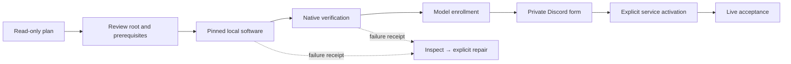

# Station Workstation — a personal AI workspace

Workstation installs the reviewed Hermes runtime, native AGK-TUI, private RMUX
session infrastructure, reusable tools and web workers on an existing macOS or
Linux machine. It does not reset the computer or run the privileged Host kernel.

## Choose the right mode

| | Workstation | Station Host |
| :-- | :-- | :-- |
| Machine | Existing macOS/Linux x64 or arm64 | Supported Ubuntu/Debian, systemd and apt |
| Identity | Your ordinary Unix user | Independent identities per Zone |
| Main location | Chosen private `station/` directory | Canonical Station FHS directories |
| Client separation | No multi-client isolation claim | Organization-owned environment Zones |
| OS instances | Not enrolled by this installer | Canonical instance ledger and mapped teams |
| Privilege | Never sudo | Explicit reviewed privileged bootstrap |
| Existing accounts | Never copied or adopted | Explicit Zone/profile enrollment |

Workstation directories and Hermes profiles are **not a sandbox**. A tool running
as your Unix user retains that user's filesystem and network authority. Use
independent Host Zones for unrelated clients and production credentials.

## Install from the repository

Prerequisites: Node **22.14+**, npm, `uv`, Git, Cargo with a working Rust toolchain,
curl, and native build tools (Xcode Command Line Tools on macOS; a compiler and
linker on Linux). Install missing prerequisites with your trusted platform
package manager. The installer reports missing tools before creating its root;
it does not silently install Homebrew, modify a Rust installation or invoke sudo.
Linux Chromium may need distribution libraries; failure is a verification gate,
not permission for automatic privileged package installation.

```bash
git clone --branch main --single-branch https://github.com/agentik-os/agentik-station.git
cd agentik-station
node installer/npm/cli.mjs plan --root "$HOME/station"

# Optional: expose the CLI using an already user-writable npm global prefix.
npm install --global .
agentik-station install --root "$HOME/station"
```

Without a global npm install, use `node installer/npm/cli.mjs` for every command.
The default root is the real account home plus `/station`. Choose an absent,
dedicated directory whose parent exists. Existing directories, including empty
unmanaged ones, are refused rather than adopted. Keep the path short enough for
RMUX's native Unix socket limit. Paths containing spaces are supported.

The repository prepares `@agentik-os/station` version `11.28.0`; this documentation
does **not** claim that npm publication has happened. After an authorized registry
publication, `npx @agentik-os/station@11.28.0` can launch the same installer.
The package has no dependencies or npm lifecycle installation scripts: npm
install alone never installs Hermes, modifies the OS or starts a gateway.
The npm package/cache itself lives in npm's chosen prefix/cache; Station-managed
runtime files and build caches live under the selected Station root.

## The installation circuit



The terminal shows real phases and checks, never fabricated percentages.
After required software verification, interactive installation offers to continue
directly into model and Discord enrollment, then offers activation separately.
Declining preserves the installation; the standalone commands below resume setup.
`--yes` applies only to software installation and skips interactive onboarding.
`NO_COLOR`, `TERM=dumb`, `CI` and redirected output disable animation and color;
`STATION_NO_ANIMATION=1` retains supported terminal colors without motion.
Use `--json` for noninteractive plans and reports. Secret enrollment and gateway
activation require an interactive terminal; tokens are not command-line flags.
Installation failures identify a fixed phase such as `hermes` or `tool-resources`
in the error and private receipt. Native acceptance logs expose only bounded,
allowlisted check identifiers and statuses, never captured tool output or tokens.

### What gets installed and what remains a gate

- Hermes at the reviewed Git commit, with its frozen dependency lock and
  messaging/voice/MCP extras, using a private Python 3.11 environment.
- The complete AGK support tree, Rust TUI, Python controller, dashboard assets,
  themes, rules and native plugins. RMUX has its own socket and verified native
  release; existing user daemons are not repaired or terminated.
- Pinned Vercel, Codex and shadcn CLIs, plus the `discord.js` SDK, in reusable
  resources. App dependencies such as Lucide, Next.js, Convex, Clerk and Stripe
  remain selected **Project dependencies**, not global application scaffolding.
- Crawl4AI and ScrapeGraphAI in separate Python environments, with private
  Chromium and tokenizer assets. Verification imports the actual libraries and
  launches Chromium; it does not call a paid model or accept an external website
  extraction workflow.
- GitHub and Composio native connectors have their own pinned artifacts and
  version checks. Authentication is an explicit subsequent account action.
- ChatbotX CLI `0.1.3` is installed by default, with a private Node launcher and
  exact executable checksum. Its version/help probes use a fresh HOME, because
  its configured startup can fetch a remote schema. The copied
  `resources/chatbotx` guide, license and disabled native MCP example are checked
  byte-for-byte. Workspace enrollment and full application deployment remain
  separate; no local npm MCP server package exists at the reviewed version.
- Linux service recipes are **not** silently converted into macOS services.
  Parakeet, memory servers, Tailscale and TigerVNC have separate installation and
  acceptance requirements. Strix remains an approved disposable Linux LAB
  capability; Ponytail's native compatibility guard is never bypassed.
- Voice Python extras and default model declarations do not prove ffmpeg, Opus,
  PortAudio, audio hardware, paid APIs or Discord audio work. These remain
  distinct checks; do not infer full voice readiness from the package list.

The core/required checks gate gateway activation. `ready-for-setup` means only
that the required Workstation software passed local verification; the report's
`capabilityStatus` remains `incomplete` while account/service gates remain.
Optional unavailable capabilities stay visibly blocked; they are not falsely
declared operational or allowed to require a guard bypass. Actual failed checks
still produce failure. Accounts, process observation and live acceptance are separate.

## Everything has a place

```text
station/
├── .station-workstation.json        validated ownership and profile context
├── bin/                            scoped launchers, no global agk shadowing
├── tools/
│   ├── hermes/source/               exact reviewed upstream code
│   ├── hermes/venv/                 frozen Hermes dependencies
│   ├── agk-terminal/                shipped UI, controller and support files
│   ├── rmux/                       verified client, daemon and full executable
│   ├── python/                     uv-managed compatible Python runtimes
│   └── web/                        independent extraction environments
├── resources/                      reusable tool/SDK inputs
├── personal/home/
│   ├── .hermes/profiles/station-…/  one installation-specific Hermes identity
│   └── .config/                    private provider and AGK configuration
├── projects/                       personal Project workspaces
├── cache/                          isolated builds, downloads and RMUX socket
└── evidence/                       unique receipts, including failed attempts
```

`station-…` is derived from the installation root. Moving a root is not supported:
virtual environments, launchers and service definitions contain absolute paths.
Do not alias this namespace to a client Zone or install an OS-instance ledger by
copying a catalog. The Linux Host architecture and `os/` source of truth remain
unchanged.

On case-insensitive macOS disks the pinned Hermes source has two colliding
contributor-email filenames. The installer uses an explicit sparse checkout
excluding only `contributors/emails/`; runtime code stays at the exact pin.
Both the sparse selection and tracked source cleanliness are checked.

The reviewed Composio 0.4.0 macOS arm64 executable can be killed by macOS because
its upstream code signature is invalid. The installer discloses this before
confirmation and, for this exact known artifact only, preserves the verified
original while making a separately recorded, locally ad-hoc-signed copy. It
checks the original digest, derived digest, signature and native version. This
is **not publisher notarization** and does not disable Gatekeeper or change
system security settings. The symptom is consistent with the
[upstream Bun compiled-binary signing report](https://github.com/oven-sh/bun/issues/39764);
that report alone is not proof of Composio's compiler provenance.

## Connect Discord, privately

```bash
agentik-station model --root "$HOME/station"
agentik-station discord --root "$HOME/station"
agentik-station verify --root "$HOME/station"
agentik-station activate --root "$HOME/station"
agentik-station status --root "$HOME/station"
```

1. The model command opens the **native Hermes model-only wizard** for this
   profile. It does not invoke the gateway wizard that can start services early.
2. Create a bot in the Discord Developer Portal. The guided form asks for the
   application, server and private command-channel IDs, authorized human IDs,
   and a locally masked bot token. Nothing is copied from another Hermes home.
3. Enable Message Content Intent and review the generated text-only invite.
   The default invite does not grant Administrator or voice permissions. Native
   channel restrictions apply to guild messages; authorized humans may also DM.
   A server ID in an invite is not a separate runtime guild ACL.
4. Configuration is written only to the private profile. It does not create a
   guild, mint bot tokens, build every OS channel or grant the bot Unix sudo.
5. After verification, activation explains and confirms the exact native service
   and its network/tool authority. Existing units or plists are never replaced.
6. Accept a real reply from an authorized user in the intended channel, reject
   an unauthorized user/channel, and check provider identity/billing. Only this
   external readback can establish live acceptance.

**Service exceptions to the one-folder layout:** macOS requires an account-level
`~/Library/LaunchAgents/ai.hermes.gateway-station-….plist`. Linux user systemd
links/enables the private unit in the account's systemd configuration. Both are
created only at explicit activation. The daemon itself receives a cleared,
private HOME/environment. Linux activation does not enable linger; survival
after logout depends on the existing user-manager policy. Closing a terminal is
not proof of restart/reboot acceptance.

Native activation is intentionally fresh-only. To rotate a token, change a
running policy, recover a failed activation or replace a service, inspect and
stop the **exact named** service first; preserve its definition and evidence.
Enrollment is fresh/unloaded-only: merely stopping a systemd process may leave
its unit loaded and is not sufficient. Unloading/removing a known service
definition or migrating its configuration is a separately reviewed recovery
operation. There is no automatic force/restart/reset. Other Hermes chat adapters remain
available natively, but this first Workstation guided form is Discord-specific.

## Verify, repair and upgrade without erasing work

```bash
agentik-station verify --root "$HOME/station" --json
agentik-station repair --root "$HOME/station" --yes
agentik-station tui --root "$HOME/station"
# Direct scoped launcher; no PATH or shell-startup modification required:
"$HOME/station/bin/agk" status
```

Repair resumes missing owned software only after explicit review. It refuses
changed source, substituted paths, unmanaged content and competing operation
locks. It does not erase projects, credential files, evidence or prior attempts.
A stale `.install.lock` needs operator inspection, not blind deletion.
Changed installed support files require a reviewed migration; this initial
Workstation release does not implement in-place version upgrades or unattended
auto-update. Use a new dedicated root for a newly reviewed version and reenroll
deliberately. Never move virtual environments or copy accounts automatically.

Noninteractive subprocesses use bounded output/time and a held process-group
supervisor. Same-group children are cleaned up after completion or cancellation.
This is not containment against processes creating new sessions, a network
sandbox or protection against code running as the same UID. Interactive TUI and
model-wizard processes retain their distinct native lifecycle.

## npm publication

Prepare and test with `npm test` and `npm pack`; the packed CLI is independently
smoke-tested. Do not paste an npm token into chat, Git, flags or receipts. An
authorized maintainer can configure npm Trusted Publishing with a reviewed
GitHub workflow and package ownership, or authenticate locally using npm's
official flow. No publishing workflow or registry ownership is assumed by this
release, and no token is needed to test/install the local package.
