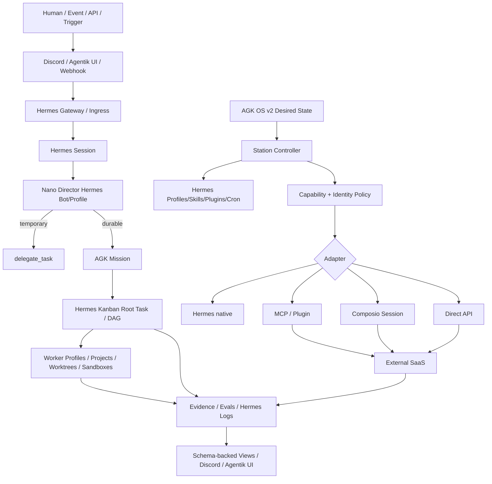

# Canonical Architecture — Station v7

## Rule

AGK defines *what is allowed and what outcome exists*. Hermes decides *how agentic execution runs*. Composio may supply a scoped external-tool/auth plane. Station enforces boundaries and lifecycle. Agentik distributes and visualizes the resulting organization.
