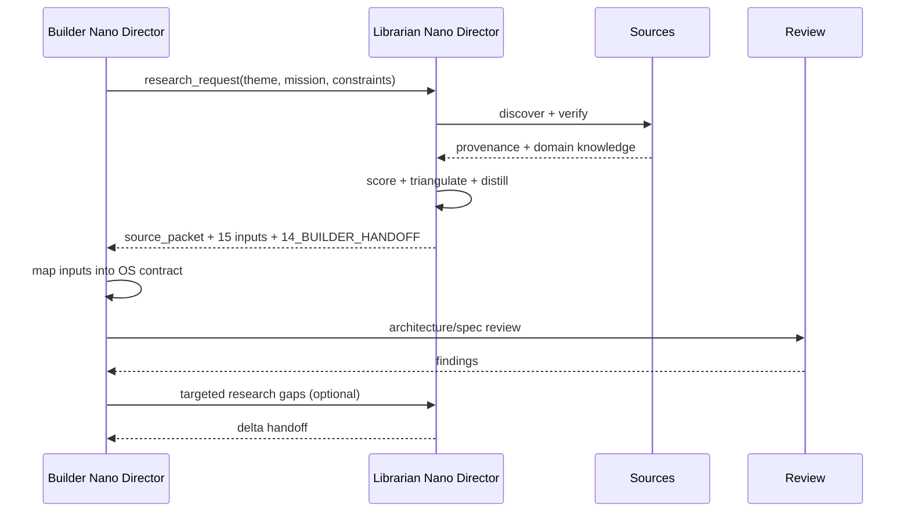

# Builder ↔ Librarian Handshake

```mermaid
sequenceDiagram
  participant B as Builder Nano Director
  participant L as Librarian Nano Director
  participant S as Sources
  participant R as Review

  B->>L: research_request(theme, mission, constraints)
  L->>S: discover + verify
  S-->>L: provenance + domain knowledge
  L->>L: score + triangulate + distill
  L-->>B: source_packet + 15 inputs + 14_BUILDER_HANDOFF
  B->>B: map inputs into OS contract
  B->>R: architecture/spec review
  R-->>B: findings
  B->>L: targeted research gaps (optional)
  L-->>B: delta handoff
```

The handoff is versioned. Builder records the handoff checksum in release evidence so later research refreshes do not silently change an already-released OS.
