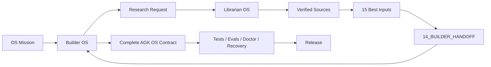

# How Builder Uses Librarian

1. Builder creates an OS mission and `research_request`.
2. Builder delegates a child research mission to Librarian OS.
3. Librarian executes `/book --deep` against the target domain using real, verified works and appropriate primary/current sources.
4. Librarian returns a versioned `source_packet.json`, exactly 15 selected inputs, contradictions, uncertainty and `14_BUILDER_HANDOFF.md`.
5. Builder maps every selected input into the target OS design. Each input must influence a component or be explicitly rejected with rationale.
6. Builder records the Librarian packet version/provenance in build evidence.
7. If implementation exposes a knowledge gap, Builder requests targeted delta research rather than guessing.
8. A later Librarian refresh creates a new handoff version; it never silently changes an already released OS.

