# Strix: a tool controlled by Hermes, not another Station brain

Station installs `strix-agent==1.6.1` into
`/opt/station/tools/security/strix-1.6.1-py3.13.15/venv`. Linux x86_64/aarch64 wheels
are SHA256-pinned in `config/versions.lock`; the sandbox image is pinned by platform
manifest digest. Dependencies are isolated from Hermes. Transitive Python packages
are resolved at installation, not yet a fully hash-locked closure.

```bash
sudo station deps install --component strix
```

Also included by `station deps install --all` / bootstrap `--with-ai-stack`.
Ordinary bootstrap keeps the security CLI optional. Installation does **not** install
Docker, grant socket access, pull an image, open a port, connect Strix cloud, start
a scan, or spend provider credits. It only checks the CLI version.

## Who controls what

```mermaid
flowchart LR
  Chat[Discord / Telegram / Slack] --> Atlas[Hermes Atlas: mission owner]
  Atlas --> Architect[Architect: exact local scope and snapshot]
  Architect --> Human[Human: source disclosure and LAB approval]
  Human --> SRE[SRE: approved job via native Hermes terminal]
  SRE --> Adapter[Station Strix adapter]
  Adapter --> Lab[Disposable LAB Host / isolated Docker target]
  Lab --> Evidence[Private Project reports and summary]
  Evidence --> Sentinel[Sentinel: independent triage and retest]
  Sentinel --> Forge[Forge: worktree fix and regression]
  Forge --> Release[Release Engineer: normal CI and promotion gate]
  Release --> Atlas
```



The existing six DevOps profiles form this mission team; see
[`STRIX.json`](../../os/devops/team/STRIX.json). No extra Discord bot or parallel
OS registry is created. Strix owns its internal assessment agents only. Hermes
retains mission state, communication, delegation and acceptance.

The native `station_strix` tool offers `prepare`, `status`, `report`. It cannot
authorize or start a scan. SRE starts approved jobs using Hermes's existing
terminal/background execution and the typed Station CLI. A chat message or Discord
button is **not** a privileged approval capability.

## Host and authorization boundary — read before enabling execution

Execution is limited to sanitized **local source** on a dedicated, disposable Linux
Station Host whose role is `lab`. No production, URL/domain/IP, Postman, arbitrary
Git URL, extra workspace, cloud, resume, MCP or custom CLI flags are exposed.

Docker socket access is host-root-equivalent. Do not grant it on the core, a shared
client Host, or production. The LAB must contain no other tenant's data, production
secrets, Tailnet administration keys or cloud deployment identity. Use a narrowly
scoped/budgeted model key and destroy the LAB after the mission. Strix's sandbox
requests elevated networking capabilities; a container does not replace this Host
boundary.

The operator provisions and accepts the worker separately:

1. Reconcile a disposable `lab` Host and owning Zone/Project. Confirm actual Unix
   traversal and cross-Zone denial, not just a root-run Doctor.
2. Install Docker on that LAB only, review socket privilege, and pre-pull the exact
   architecture image from `config/versions.lock`. Do not substitute Podman or
   rootless Docker without testing upstream's direct-container-IP control/proxy
   path; neither is asserted supported here.
3. Create a dedicated `station-strix-lab-*` **internal bridge**. Test that the
   sandbox cannot reach host management, metadata endpoints, Tailnet, other tenants
   or external targets. An internal bridge alone does NOT block its host/gateway:
   enforce host/hypervisor firewall boundaries as well. Verify the controller's
   required local sandbox/proxy connection still works.
4. Keep acceptance evidence outside model control, review it, and supply its
   SHA256 at authorization. This is an operator attestation, not automated proof
   that the network probes ran.

Root-owned grants protect the typed workflow from an ordinary non-root profile;
they are not a defense against an actor who already controls root or Docker.
Roles in SOUL/TEAM are organizational rules, not kernel permissions. This integration
adds no general sudo grant or self-approval tool.

## Step by step

Preparation/run/readback commands run **as the owning non-root LAB Zone user**, in
its native Hermes session. Identifiers below are examples. `--repo app` means
`<owning-project>/repos/app`, never an arbitrary host directory.

```bash
station security strix prepare --zone security-lab --project fixture --repo app \
  --model openai/YOUR_REVIEWED_MODEL --budget-usd 5 --timeout-seconds 600
```

This creates `workspaces/strix/strix-<id>/plan.json` and a bounded snapshot. Review
both before approval. `.git`, hidden files except `.github`, secret/key stores,
vendor/build/cache directories and common key/database files are excluded.
Symlinks, hard links, special files, cross-owner files and oversized trees fail
closed (2 MiB/file, 64 MiB/tree, 5000 files). Exclusions are **not a secret scanner**:
private data can appear in ordinary source. Review every proposed disclosure.
Code contents will be sent to the selected model during execution.

Provision the dedicated key through the existing protected setup broker:

```bash
station setup-link create \
  --state-root /var/lib/station/zones/security-lab/connector-state/setup-links \
  --base-url https://YOUR-LAB.YOUR-TAILNET.ts.net/station-setup \
  --zone security-lab --principal YOUR-VALIDATED-PRINCIPAL \
  --provider strix --purpose station-secret
```

The existing Hermes bot can deliver the provider-neutral setup card privately.
The key goes to `<zone-state>/credentials/strix-api-key`, mode `0600` under the Zone
UID, **not** ambient Hermes `.env`, chat, arguments or evidence. Broker enrollment
and private chat delivery remain normal external setup gates.

Only the human/root operator, after reviewing the snapshot and LAB evidence:

```bash
sudo station security strix approve --zone security-lab --project fixture \
  --job strix-REPLACE-ID --network station-strix-lab-fixture \
  --worker-acceptance-sha256 REPLACE-WITH-REVIEWED-64-HEX-DIGEST \
  --allow-source-to-model --disposable-lab-confirmed
```

The adapter rehashes the snapshot and writes a root-owned, Zone-group-readable
grant under `/var/lib/station/security/strix/<zone>/<project>/<job>.json`. It binds
Zone UID, Project, job, digest, version, model, budget and a one-hour expiry.
Non-LAB Hosts and missing acknowledgments are refused.

Then SRE, as the Zone user:

```bash
station security strix run --zone security-lab --project fixture --job strix-REPLACE-ID
station security strix report --zone security-lab --project fixture --job strix-REPLACE-ID
```

Approved bytes are copied into a **new disposable target**. Strix never receives a
writable mount of the original repository or reviewed snapshot. It gets a fresh
HOME/cache/tmp, empty config/MCP roster, no inherited environment, no telemetry,
one selected provider key, `quick` mode, 80 turns/agent, explicit budget and deadline.
Docker limits are 2 CPUs, 4 GiB RAM, 256 PIDs.

`--max-budget` is Strix's best-effort per-run cost limit, not a guaranteed maximum
invoice or cumulative authorization. Use provider-side spending limits. The job
directory prevents accidental reruns, but its Zone owner can alter it; this is not
an immutable one-use ledger. Renewing authorization is an operator decision.

## Results and cleanup

Private raw logs/reports stay in `workspaces/strix/<job>/execution/`; the bounded
summary is `evidence/strix/<job>/summary.json`. Clean exit is insufficient:
completion state, cost evidence and findings must agree. Upstream omits
`vulnerabilities.json` for clean scans; Station requires explicit empty SARIF then.

- `FINDINGS_REPORTED`: Sentinel must independently verify the reported findings.
- `NO_FINDINGS_REPORTED`: completed without findings, **not proof of safety**.
- `INCOMPLETE`: timeout, failure, missing/contradictory evidence, budget exhaustion
  or cleanup failure. Do not promote on this result.

Timeout/cancellation kills the controller process group. Cleanup targets only
containers labelled with this job ID; never a global prune. SIGKILL, Host failure
or compromised tooling can prevent cleanup: preserve evidence, inspect exact labels
and destroy the disposable LAB as the outer safety net. No code is auto-merged,
pushed, deployed or accepted by Strix.

## Verification boundary

Repository tests exercise scope/identity checks, unsafe paths, pins, native profile
packaging, key separation, filtered environments, synthetic process lifecycle,
timeout/cancellation, results and cleanup selection. The actual pinned CLI interface
and upstream artifact format were inspected. No image was started, real target
scanned, provider charged or source uploaded during repository verification.
Linux network acceptance, source-mount UID compatibility and a synthetic live
assessment remain deployment gates: `INSTALLABLE` is not `OPERATIONAL`.

Primary sources: [Strix v1.6.1](https://github.com/usestrix/strix/tree/v1.6.1),
[CLI](https://github.com/usestrix/strix/blob/v1.6.1/strix/interface/cli_args.py),
[Docker runtime](https://github.com/usestrix/strix/blob/v1.6.1/strix/runtime/docker_client.py),
[report state](https://github.com/usestrix/strix/blob/v1.6.1/strix/report/state.py).
